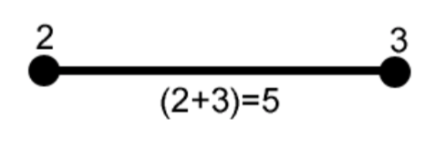
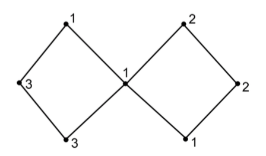
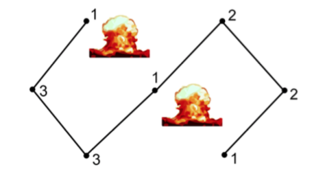

## 문제

In the year 2240 a great war is taking place between the Earth Allied Forces (EAF) and the Mars Federation (MF). Until recently, none of the two major factions could gain the upper hand in the war. Because of a recent financial crisis, both factions' resources are thinning out, and it appears that the MF is using this to their advantage to claim more territories over the EAF. In response to this, the EAF have decided to carry out its greatest operation since the start of the war: it will launch a simultaneous attack against all the MF bases that are scattered over the planet Mars. The EAF's forces mostly consist of mechs, which are huge bipedal, limbed vehicles with flying capabilities.

A typical MF base is built up as follows: The buildings that make up the base are positioned over one or multiple territories. Each of these territories is protected against outside attacks by impenetrable energy fields that are generated by shield towers. These shield towers are positioned around the territories they're supposed to protect.

Each shield tower is connected to at least one other tower via channels that are constructed above the ground. When these connected towers form a cycle, they generate an energy field. However, if a channel in a cycle is destroyed so that the cycle is broken, the energy field will disappear. The MF knows that if all energy fields disappear, the base will be easily overrun by the EAF forces. Therefore, the two towers that are connected by a channel protect the channel against armed forces. Each tower has defenses that can take down a given number of enemy mechs. Each channel can handle an attack by a certain number of enemy mechs before it collapses. This number is given by the amount of mechs that both towers, that the channel connects, can take down. Two towers cannot be connected by more than one channel.

(a) Two towers that are connected by a channel. The vertices represent the towers while the line is the channel that connects the towers. The amount of mechs needed to destroy the channel is the combined amount of mechs that the connected towers can take down.

However, attacking a channel on one side of the tower does not diminish the amount of mechs that it can take down on the other side of the tower.

Because the operation is a surprise attack, all attacks on the channels must happen simultaneously: all channels are taken down at the same moment.

(b) MF base with multiple energy fields. The vertices represent the towers while the lines are the channels that connect the towers. The numbers indicate how many mechs a tower can take down.

(c) In this case, the destruction of two channels will make all energy fields disappear. Four mechs will be lost in the battle.

All energy fields must be disabled in order to destroy a MF base. Tearing down all channels would make this happen, but would also require a lot of mechs to be sacrificed. The EAF has very little forces to spare and must therefore deploy its mechs as efficient as possible.

You have been tasked to write a program that will lead the EAF to victory. Given a graph of shield towers, determine which channels must be destroyed to make all energy fields disappear, in such a way that the least number of EAF mechs are lost during the battle.

## 입력

* The first line of input consists of the positive integer number n, the number of test cases;
* Then, for each test case:
  + A line containing the positive integer number m (2 < m ≤ 100), the number of towers in the base;
  + Per tower two lines:
    - A line containing three positive integer numbers i (0 ≤ i ≤ m−1), ui (1 ≤ ui ≤ 50) and ci (1 ≤ ci ≤ m − 1): the (identification) number of the tower, the amount of mechs that the tower can take down and the number of channels respectively. The numbers are separated by a space;

A line containing ci different positive integers, the towers that are connected to tower i. A tower cannot be connected to itself. The integers are separated by a space.

## 출력

For each test case, the output contains a line with one number: the minimum number of EAF mechs that will be lost during the battle to make all energy fields disappear.
