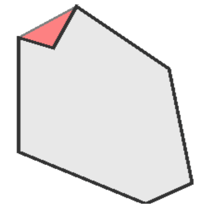

## 문제

Mr. Chou is the flatworld diamond dealer. It is important that he knows the value of his (two dimensional) diamonds in order to be a successful businessman. Mr. Chou is tired of calculating the values by hand and you have to write a program that makes the calculation for him.

The value of a diamond is determined by smoothness of its surface. This depends on the amount of faces on the surface, more faces means a smoother surface. If there are dents (marked red in figure 2) in the surface of the diamond, the value of the diamond decreases. Counting the number of dents in the surface (a) and the number of faces on the surface that are not in dents (b), the value of the diamond is determined by the following formula: v = −a · p + b · q. When v is negative, the diamond has no value (ie. zero value).

## 입력

* The first line of input consists of the integer number n, the number of test cases;
* Then, for each test case:
  + One line containing:
    - The cost for a dent in the surface of a diamond (0 <= p <= 100);
    - The value of a face in the surface of a diamond (0 <= q <= 100);
    - The number of vertices (3 <= n <= 30) used to describe the shape of the diamond.
  + n lines containing one pair of integers (-1000 <=xi,yi <= 1000) describing the surface of the diamond (x0,y0) - (x1,y1) -.....-(xn-1, yn-1) - (x0 ,y0) in clockwise order.

No combination of three vertices within one diamond will be linearly aligned.

## 출력

For each test case, the output contains one line with one number: the value of the diamond.
