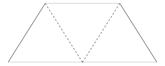
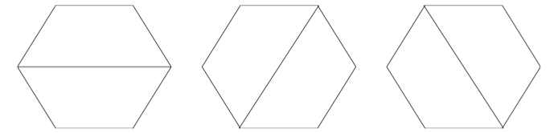
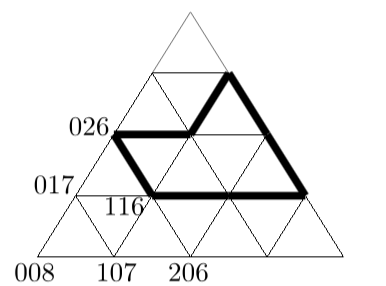

## 문제

The cafeteria of the EWI Faculty of Delft University of Technology has a lot of tables. These tables are not square or rectangular, they have the form of a trapezoid, an isosceles trapezoid, with sides 1,1,1,2, as in the drawing below. It can be seen as half a hexagon or as composed of three equilateral triangles. Such a table offers place for five to sit, though at the acute angles there is few space for plates.

The shape of a table.

For larger companies, the tables can be put together to form a larger table. The more tables are used, the more shapes can be created. The other way round, one may ask whether a given shape can be built with these tables and whether that can be done in more than one way. A hexagon can be built from two tables in three different ways.

Three different ways to form a hexagon.

It could be argued that these three solutions may be reduced to a single solution, using rotation. For this problem we consider these three solutions to be different, however.

The triangle encoding.

The shapes to be formed are described using a pattern of triangles. The nodes in this pattern have a code formed from 3 digits, in the range 0...8. The sum of these three digits is 8. We describe a shape by enumerating the nodes of its contour: [116, 314, 134, 125, 026]. The contour is built connecting the nodes along the gridlines: connect the first node with the second node, the second node with the third one, etc., and finally connect the last node with the first. This implies that neighboring nodes are always on a common gridline.

The following rules apply:

1. When walking along a contour, the enclosed area is on the left-hand side;
2. The enclosing contour does not cross itself, nor are nodes used multiple times;
3. The enclosed shape has no holes (in fact this is a consequence of 1 and 2).

A shape is given by the nodes of the enclosing contour. Calculate the number of ways this shape can be made using the trapezoid tables.

## 입력

The first line of the input file contains a single number: the number of test cases to follow. Each test case has the following format:

* The first line contains a single number, n, the number of nodes of the contour.
* The second line contains n codes for the nodes of the contour, as described above. These codes are separated by a single space.

## 출력

For every test case in the input file, the output should contain a single number, on a single line: the number of different ways of creating the given shape with the trapezoid tables.
