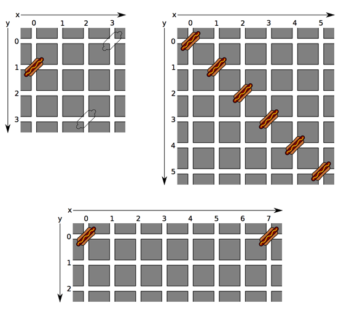

## 문제

The two friends Barack and Mitt have both decided to set up their own hot dog stand in Manhattan. They wish to find the two optimal locations for their stands.

First of all, they both want to put their stand at an intersection, since that gives them maximum exposure. Also, this being Manhattan, there are already quite a few stands in the city, also at intersections. If they put up a stand close to another (or each other’s) stand, they might not get that many customers. They would therefore like to put their stands as far from other stands as possible.

We model Manhattan as a finite square grid, consisting of w vertical streets and h horizontal streets. The vertical streets run from x = 0 to x = w − 1, while horizontal streets run from y = 0 to y = h−1. All pairs of consecutive parallel streets are separated by the same distance, which we set as the unit distance. The distance between two intersections (x1, y1) and (x2, y2) is then given by |x1 − x2| + |y1 − y2|.

We indicate an intersection’s suitability by its privacy, which is the minimum of all distances from this intersection to all other hot dog stands. Barack and Mitt would like to find two intersections with the maximum amount of privacy, i.e. such that the smallest of the two privacies is as large as possible. Note that the privacy of Barack’s location can be determined by the distance to Mitt’s location and vice versa.

## 입력

On the first line one positive number: the number of test cases, at most 100. After that per test case:

* one line with three space-separated integers n, w and h (0 ≤ n ≤ 1 000 and 2 ≤ w, h ≤ 1 000): the number of hot dog stands already in place and the number of vertical and horizontal streets, respectively.
* n lines, each with two space-separated integers xi and yi (0 ≤ xi < w and 0 ≤ yi < h): the intersection where the i-th hot dog stand is located.

All hot dog stands are at different intersections. At least two intersections do not contain a stand.

## 출력

Per test case:

* one line with one integer: the maximum privacy that Barack and Mitt can both obtain.

## 힌트

These sample cases are illustrated below. Only for the first case, the optimal placement of the two new stands is given (indicated by the dashed outlines).

