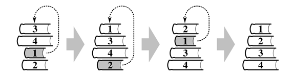

## 문제

선영이는 다양한 크기의 책을 쌓아서 스택 형태로 보관한다. 이런 스택의 가장 위에서부터 크기가 감소하지 않는 순서로 책이 쌓여져 있다면, 스택이 안정된 상태라고 한다. 그렇지 않은 경우에는 스택이 무너질 수도 있다.

선영이는 책이 무너지는 것을 막기 위해서 크기 순으로 스택을 정렬하려고 한다. 선영이는 스택의 중간 (또는 바닥)에서 책을 하나 뺀 다음, 가장 위에 놓는다. 하지만, 빼려고 하는 책의 위에 있는 스택이 안정된 상태이어야 한다.

아래 그림은 3, 4, 1, 2로 쌓여진 책을 크기 순으로 정렬하는 방법이다.

현재 책이 쌓여져 있는 상태가 입력으로 주어졌을 때, 안정된 상태로 책을 쌓기 위해 최소 몇 단계가 필요한지 구하는 프로그램을 작성하시오. 위의 그림의 경우에 답은 3이다.

## 입력

첫째 줄에 테스트 케이스의 개수가 주어진다. 테스트 케이스의 수는 100보다 작거나 같다.

각 테스트 케이스의 첫째 줄에는 책의 수 n이 주어진다. (1 ≤ n ≤ 50) 다음 줄에는 책의 크기 si가 스택의 맨 위에서부터 순서대로 주어진다. (1 ≤ si ≤ 1000)

## 출력

각 테스트 케이스에 대해서, 필요한 단계의 수의 최솟값을 출력한다.
