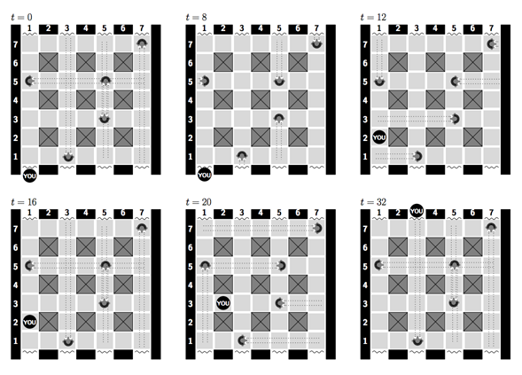

## 문제

A large palace contains a hall, of which the floor plan can be described as a (2n − 1) by (2n − 1) grid of squares, arranged in 2n − 1 rows numbered from 1 to 2n − 1, and in 2n − 1 columns numbered from 1 to 2n − 1—see the figure below for an example with n = 4. Each square that is on the intersection of an even-numbered row and an even-numbered column is covered by a square wooden support column. The other squares are empty. Thus, between the walls and the wooden supports, there are n corridors from left to right and n corridors from back to front through the hall. At the ends of the back-to-front corridors, there are door openings with curtains. Otherwise the walls are closed.

The hall is guarded by k guards. Each of these guards is stationed at a crossing of a front-to-back and a left-to-right corridor. Each of these guards looks 4 seconds in the direction of the left side of the hall, 4 seconds to the back of the hall, 4 seconds to the right, and then 4 seconds to the front, and repeats this cycle indefinitely. However, the guards are not necessarily in phase: for example, some guards may start the cycle by looking to the left, while others start by looking to the front.

A ninja must traverse the hall from front to back without meeting a guard and without being seen. Before entering the hall, the ninja waits in row 0, that is, behind any of the curtains in the door openings of the front wall. He can choose behind which curtain to wait, and for how long, until he enters the hall. The ninja can choose any door in the back wall as the place to exit. The ninja takes 2 seconds to walk from one square to an adjacent square—while walking, the ninja would be seen by any guard that is currently observing one of these squares. Can the ninja traverse the hall successfully? Note that the guards can see past each other, but not through curtains.

Figure 1 on the next page shows an example, in which the ninja finds a way through. First, the ninja waits. After 8 seconds, the guard in row 5, column 1, turns its face to the left, and the ninja steps through the curtain. After 10 seconds, the ninja arrives at row 1, column 1. After 12 seconds, the ninja arrives at row 2, column 1. The ninja waits there until the guard at row 3, column 5 turns its face to the back of the hall; then the ninja starts walking and disappears behind the curtain in column 3 just before the guard in row 1 turns its face in that direction.

## 입력

The first line of the input contains a single number: the number of test cases to follow. Each test case has the following format:

* One line with two integer numbers: n (the number of corridors in each direction, 1 ≤ n ≤ 250) and k (the number of guards, 0 ≤ k ≤ 500).
* k lines, one for each guard: each row contains an odd integer number r (1 ≤ r ≤ 2n − 1), an odd integer number c (1 ≤ c ≤ 2n − 1), and one of the letters L, B, R, or F. The first number is the row in which the guard is placed; the second number is the column in which the guard is placed, and the letter indicates in which direction the guard is looking at time zero (left, back, right, or front).

There is at most one guard at any particular position in the hall.

## 출력

For every test case in the input, the output should contain a single line with either the word succeeds, or the word fails.

## 힌트

Figure 1: The ninja succeeds in traversing the hall from front to back without being seen.
