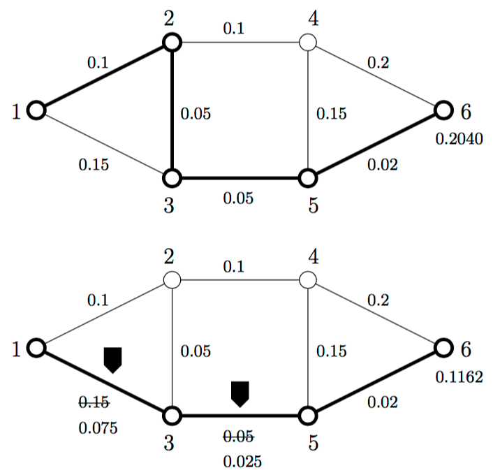

## 문제

Gold transports are risky nowadays in Bancopia due to the numerous robberies. Some roads are more dangerous than others. In order to minimize the probability of a robbery on a gold transport between two given cities, the Bancopians want to place police posts on some of their roads, which will make those roads safer.

In this task the input will consist of an overview of the cities in Bancopia and the roads between them, together with the two cities the gold transport is between. For each road, the probability of a robbery is given. With the robbery probability of a road between two cities we mean the probability that, given that a gold transport travels over that road, a robbery happens there, on that transport. We assume that when a gold transport travels over a number of roads, the robbery probabilities on these roads are independent.

Finally, the maximum number of police posts is given. On every road at most one police post can be placed. A Bancopian police post exactly halves the robbery probability of that road. The question is how large the probability is of a robbery on a gold transport that takes the safest route between the two given cities when the police posts are placed in such a way that this probability is minimized.

## 입력

The first line of the input file contains a single number: the number of test cases to follow. Each test case has the following format:

* One line with the five integers n, w, m, a and b, separated by spaces. 2 ≤ n ≤ 100 is the number of cities, 1 ≤ w ≤ 104 the number of roads, 1 ≤ m ≤ 100 the maximum number of police posts to be placed, and a and b are the cities between which the transport is to take place. Cities are always designated by an unique number in the set {1, . . . , n}.
* w lines, each of which describes one road, with three numbers, separated by spaces: s1, s2 and p. s1 and s2 are the cities the road connects (s1 ≠ s2, 1 ≤ s1,s2 ≤ n) and 0 ≤ p ≤ 1 is the robbery probability of that road.

No two roads in the input will connect the same pair of cities. A road is always considered bidirectional and the robbery probability does not depend on the direction the road is travelled. Finally, it is guaranteed that there is a route from city a to city b with the roads in the input.

## 출력

For every test case in the input file, the output should contain a single number, on a single line: the probability that a gold transport that travels along the safest route from a to b is robbed, when at most m police posts are placed in such way that this probability is minimized, rounded to four decimals after the decimal point. The rounding should be done as usual: 0.12345 . . . is rounded to 0.1235, 0.12344 . . . to 0.1234.

Figure 1: These maps correspond to the example. The first map gives the safest route without police posts; the second one gives the safest route in the solution. The cities are numbered and the robbery probability is shown next to each road. Next to city 6, the destination city, the probability of a robbery on the entire route is given.
