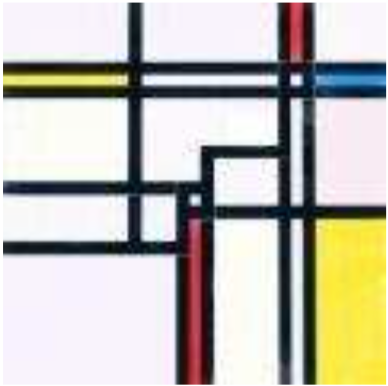

## 문제

The great Dutch painter Piet Mondriaan (1872–1944) is considered one of the first modern painters. A major part of his compositions is divided in a couple of rectangular regions. Some of them are filled with a color, while the remaining ones are left white.

Mondriaan’s colorings usually obeyed the following rules:

* Every colored region is either red, yellow or blue;
* Two (horizontally or vertically) adjacent regions don’t have the same color. White is not considered a color, so two adjacent regions can be both white.

Once a painting is divided in regions, there are still a lot of different ways to fill these with colors. Mondriaan is wondering how many different ways there are for a given division. For the paintings we consider, this number will not exceed 106.

Two regions that only touch at a corner point are not considered adjacent.

## 입력

The first line of the input file contains a single number: the number of test cases to follow. Each test case has the following format:

* One line with one positive number n with 1 ≤ n ≤ 100: the number of regions in the painting.
* n lines with four non-negative integers x1, y1, x2 and y2 with 0 ≤ x1, x2, y1, y2 ≤ 109: the coordinates of two opposite vertices of a region. Every region has a non-zero area, regions will not overlap and the union of the regions will form a rectangular painting. (Therefore, the illustration above would be an invalid input case for this problem.)

## 출력

For every test case in the input file, the output should contain a single number, on a single line: the number of ways the painting can be colored.
