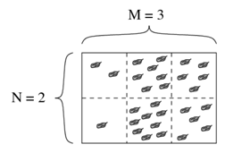
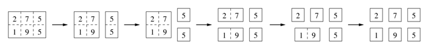

## 문제

플로브디브의 유명한 초콜릿 가공업자 Bonny는 가로 M개, 세로 N개의 격자에 건포도들이 들어있는, N\*M크기의 건포도 초콜릿을 만들었다. 각 1\*1 격자에는 최소 1개 이상의 건포도가 들어있으며, 2개 이상의 격자를 가로질러서 존재하는 건포도는 없다.

초기에, 초콜릿은 하나의 거대한 단일 블록으로 이루어져 있고, Bonny는 이 초콜릿을 N\*M개의 단일 블록으로 나눠야 한다. Bonny는 굉장히 바쁘기 때문에 욕심쟁이 Peter에게 이 일을 맡기려고 한다. Peter는 직사각형 전체를 일직선으로 자르는 행동만 할 수 있으며, 한번 자를때마다 그에 따른 보상을 요구한다.

Bonny는 수중에 돈이 없지만 남은 건포도가 상당하기 때문에 Peter에게 돈 대신 건포도를 지불하려 한다. 욕심쟁이 Peter는 이 제안을 동의했지만, "초콜릿 한 조각을 작은 두 조각으로 자를 때마다, 초기 큰 초콜릿에 있었던 건포도의 개수만큼의 수입을 받아야 한다" 는 조건을 걸었다.

Bonny는 Peter에게 최소한의 건포도를 주려 한다. Bonny는 각 조각에 있는 건포도의 수를 알며, Peter가 잘라야 하는 건포도의 조각이나 위치 모두 Bonny가 결정할 수 있다. Bonny가 지불해야 하는 건포도의 최소 양을 구하여라.

## 입력

표준 입력으로부터 다음의 데이터를 읽어야 한다 :

* 첫 번째 줄에는 건포도의 크기 N,M이 주어진다.
* 이후 N개 줄에 M개의 정수 Rij가 주어진다. 이는 i행 j열에 있는 건포도의 수이다.
* 1 <= N,M <= 50
* 1 <= Ri,j <= 1000

## 출력

Bonny가 주어야 하는 건포도의 양의 최솟값을 출력한다.

## 힌트

다음과 같이 자르면 77개의 건포도를 주고 초콜릿을 자를 수 있다.

