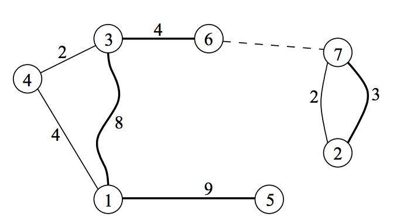

## 문제

You are visiting a park which has N islands. From each island i, exactly one bridge was constructed. The length of that bridge is denoted by Li. The total number of bridges in the park is N. Although each bridge was built from one island to another, now every bridge can be traversed in both directions. Also, for each pair of islands, there is a unique ferry that travels back and forth between them.

Since you like walking better than riding ferries, you want to maximize the sum of the lengths of the bridges you cross, subject to the constraints below.

* You can start your visit at an island of your choice.
* You may not visit any island more than once.
* At any time you may move from your current island S to another island D that you have not visited before. You can go from S to D either by:
  + Walking: Only possible if there is a bridge between the two islands. With this option the length of the bridge is added to the total distance you have walked, or
  + Ferry: You can choose this option only if D is not reachable from S using any combination of bridges and/or previously used ferries. (When checking whether it is reachable or not, you consider all paths, including paths passing through islands that you have already visited.)

Note that you do not have to visit all the islands, and it may be impossible to cross all the bridges.

Write a program that, given the N bridges along with their lengths, computes the maximum distance you can walk over the bridges obeying the rules described above.

## 입력

Your program must read from the standard input the following data:

* Line 1 contains the integer N, the number of islands in the park. Islands are numbered from 1 to N, inclusive. (2 ≤ N ≤ 1,000,000)
* Each of the next N lines describes a bridge. The ith of these lines describes the bridge constructed from island i using two integers separated by a single space. The first integer represents the island at the other endpoint of the bridge, the second integer represents the length Li of the bridge. You may assume that for each bridge, its endpoints are always on two different islands. (1 ≤ Li ≤ 100,000,000)

## 출력

Your program must write to the standard output a single line containing one integer, the maximum possible walking distance.

NOTE 1: For some of the test cases the answer will not fit in a 32‐bit integer, you might need int64 in Pascal or long long in C/C++ to score full points on this problem.

NOTE 2: When running Pascal programs in the contest environment, it is significantly slower to read in 64‐bit data types than 32‐bit data types from standard input even when the values being read in fit in 32 bits. We recommend that you read the input data into 32‐bit data types.

## 힌트

The N=7 bridges in the sample are (1‐3), (2‐7), (3‐4), (4‐1), (5‐1), (6‐3) and (7‐2). Note that there are two different bridges connecting islands 2 and 7.

One way that you can achieve maximum walking distance follows:

* Start on island 5.
* Walk the bridge of length 9 to reach island 1.
* Walk the bridge of length 8 to reach island 3.
* Walk the bridge of length 4 to reach island 6.
* Take the ferry from island 6 to island 7.
* Walk the bridge of length 3 to reach island 2.

By the end you are on island 2 and your total walking distance is 9+8+4+3 = 24. The only island that was not visited is island 4. Note that at the end of the trip described above you can not visit this island any more. More precisely:

* You are not able to visit it by walking, because there is no bridge connecting island 2 (where you currently stand) and island 4.
* You are not able to visit it using a ferry, because island 4 is reachable from island 2, where you currently stand. A way to reach it: use the bridge (2‐7), then use a ferry you already used to get from island 7 to island 6, then the bridge (6‐3), and finally the bridge (3‐4).
