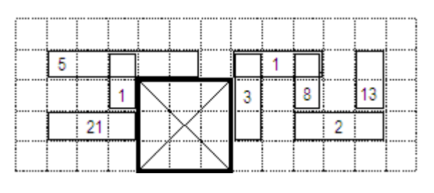

## 문제

You have been asked to find the largest affordable location for constructing a new pyramid.  In order to help you decide, you have been provided with a survey of the available land which has been conveniently divided into an M by N grid of square cells. The base of the pyramid must be a square with sides parallel to those of the grid.

The survey has identified a set of P possibly overlapping obstacles, which are described as rectangles in the grid with sides parallel to those of the grid. In order to build the pyramid, all the cells covered by its base must be cleared of any obstacles. Removing the ith obstacle has a cost Ci. Whenever an obstacle is removed, it must be removed completely, that is, you cannot remove only part of an obstacle. Also, please note that removing an obstacle does not affect any other obstacles that overlap it.

Write a program that, given the dimensions M and N of the survey, the description of the P obstacles, the cost of removing each of the obstacles, and the budget B you have, finds the maximum possible side length of the base of the pyramid such that the total cost of removing obstacles does not exceed B.

## 입력

Your program must read from the standard input the following data:

* Line 1 contains two integers separated by a single space that represent M and N respectively. (1 ≤ M, N ≤ 1,000,000)
* Line 2 contains the integer B, the maximum cost you can afford (i.e., your budget). (B = 0)
* Line 3 contains the integer P, the number of obstacles found in the survey. (1 ≤ P ≤ 1,000)
* Each of the next P lines describes an obstacle. The ith of these lines describes the ith obstacle. Each line consists of 5 integers: Xi1, Yi1, Xi2, Yi2, and Ci separated by single spaces. They represent respectively the coordinates of the bottommost leftmost cell of the obstacle, the coordinates of the topmost rightmost cell of the obstacle, and the cost of removing the obstacle.    The bottommost leftmost cell on the grid has coordinates (1, 1) and the topmost rightmost cell has coordinates (M, N). (1 ≤ Xi1 ≤ Xi2 ≤ M, 1 ≤ Yi1 ≤ Yi2 ≤ N, 1 ≤ Ci ≤ 7,000)

## 출력

Your program must write to the standard output a single line containing one integer, the maximum possible side length of the base of the pyramid that can be prepared. If it is not possible to build any pyramid, your program should output the number 0.

## 힌트

The figure shows the only possible location for the pyramid's base having a side of length 3.
