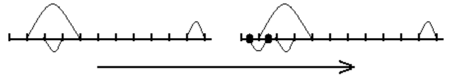

## 문제

You are participating in a competition that involves crossing Egypt from west to east along a straight line segment. Initially you are located at the westmost point of the segment. It is a rule of the competition that you must always move along the segment, and always eastward.

There are N teleporters on the segment. A teleporter has two endpoints. Whenever you reach one of the endpoints, the teleporter immediately teleports you to the other endpoint. (Note that, depending on which endpoint of the teleporter you reach, teleportation can transport you either eastward or westward of your current position.) After being teleported, you must continue to move eastward along the segment; you can never avoid a teleporter endpoint that is on your way. There will never be two teleporter endpoints at the same position. Endpoints will be strictly between the start and the end of the segment.

Every time you get teleported, you earn 1 point. The objective of the competition is to earn as many points as possible. In order to maximize the points you earn, you are allowed to add up to M new teleporters to the segment before you start your journey. You also earn points for using the new teleporters.

You can set the endpoints of the new teleporters wherever you want (even at non‐integer coordinates) as long as they do not occupy a position already occupied by another endpoint. That is, the positions of the endpoints of all teleporters must be unique. Also, endpoints of new teleporters must lie strictly between the start and the end of the segment.

Note that it is guaranteed that no matter how you add the teleporters, you can always reach the end of the segment.

Write a program that, given the position of the endpoints of the N teleporters, and the number M of new teleporters that you can add, computes the maximum number of points you can earn.

## 입력

Your program must read from the standard input the following data:

* Line 1 contains the integer N, the number of teleporters initially on the segment.
* Line 2 contains the integer M, the maximum number of new teleporters that you can add.
* Each of the next N lines describes one teleporter. The ith of these lines describes the ith teleporter. Each line consists of 2 integers: Wi and Ei separated by a space. They represent respectively the distances from the beginning of the segment to the western and eastern endpoints of the teleporter.

No two endpoints of the given teleporters share the same position. The segment that you will be travelling on starts at position 0 and ends at position 2,000,001.

## 출력

Your program must write to the standard output a single line containing one integer, the maximum number of points you can earn.

## 힌트

The first figure shows a segment with the three original teleporters. The second figure shows the same segment after adding a new teleporter with endpoints at 0.5 and at 1.5.

After adding the new teleporter as shown in the figure, your travel would be the following:

* You start at position 0, moving eastward.
* You reach the endpoint at position 0.5 and get teleported to position 1.5 (you earn 1 point).
* You continue to move east and reach endpoint at position 2; you get teleported to position 3 (you have 2 points).
* You reach endpoint at position 4, and get teleported to 1 (you have 3 points).
* You reach endpoint at 1.5, and get teleported to 0.5 (you have 4 points).
* You reach endpoint at 1, and get teleported to 4 (you have 5 points).
* You reach endpoint at 10, and get teleported to 11 (you have 6 points).
* You continue until you reach the end of the segment finishing with a total score of 6 points.
