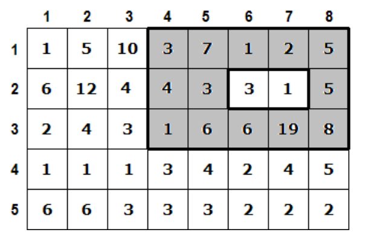

## 문제

After winning a great battle, King Jaguar wants to build a pyramid that will serve both as a monument to remember his victory and as a tomb for the brave soldiers that died in battle. The pyramid will be built in the battlefield and will have a rectangular base of a columns by b rows. Inside it, at ground level, is a smaller, rectangular chamber of c columns by d rows that will contain the corpses and weapons of the fallen soldiers.

The King’s architects have surveyed the battlefield as an m columns by n rows grid and have measured the elevation of each square as an integer.

Both the pyramid and the chamber are to be built covering complete squares of the grid and with their sides parallel to those of the battlefield. The elevation of the squares of the internal chamber must remain unchanged but the remaining terrain of the base of pyramid will be leveled by moving sand from higher squares to lower ones. The final elevation of the base will be the average elevation of all the squares of the base (excluding those of the chamber). The architects are free to locate the internal chamber anywhere within the pyramid as long as they leave a wall at least one square thick surrounding the chamber.

Help the architects pick the best place to locate the pyramid and the internal chamber so that the final elevation of the base is the maximum possible for the sizes given.

The figure shows an example of the battlefield; the number in each square represents the elevation of the terrain in that particular position of the field. The gray squares represent the base of the pyramid while the surrounded white squares represent the chamber. This figure illustrates an optimal placement.

Write a program that, given the dimensions of the field, the pyramid, and the chamber along with the elevation of every square in the field, locates both the pyramid in the field and the chamber inside the pyramid so that the elevation of the base is the maximum possible.

## 입력

LINE 1: Contains six space-separated integers, respectively: m, n, a, b, c, and d.

NEXT n LINES: Each line contains m space-separated integers that represent the elevations of one row of the grid. The first of these lines represents the top row (row 1) of the grid, and the last line represents the bottom row (row n). The m integers in each line represent the elevations of squares of that row starting from column 1.

## 출력

LINE 1: Must contain 2 space-separated integers that represent the upper-left corner of the base of the pyramid, the first number being the column and the second the row.

LINE 2: Must contain 2 space-separated integers that represent the upper-left corner of the chamber inside the pyramid, the first number being the column and the second the row.

NOTE: If there are multiple optimal placements, then any one of them you output will be considered correct.
