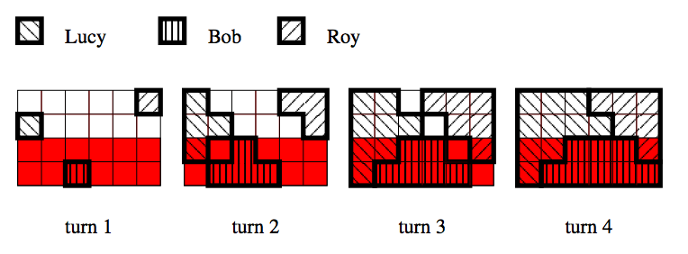

## 문제

Three children are building Polish flag from square blocks. The flag will be a rectangle, 3n blocks wide and 2n blocks high, where n is a positive integer. It will consist of 3n2 white blocks and 3n2 red blocks. The children are going to lay blocks on a rectangle table. There are 6n2 slots on the table. The white blocks should occupy the top n rows, and the red blocks should occupy the bottom n rows. Rows are numbered from 1 to 2n from top to bottom. Columns are numbered from 1 to 3n from left to right.

The children are laying blocks in turns. In the first turn Lucy puts her block on the left edge at position (1 ,l), Bob puts his block on the bottom edge at position (b,2n), Roy puts his block on the right edge at position (3n,r), where 1 ≤ l,r < 2n, 1 < b < 3n.

Every next turn they lay blocks as follows. The child can put a block in a given slot only if the slot is empty and the block to be put would be adjacent to one of the blocks put in the preceding turn. (Two blocks are adjacent if they have a common side.) In a given turn the child puts as many blocks as possible. Only one block can be put into a single slot. If two or more children want to put a block into the same slot in the same turn then the highest priority has Lucy, then Bob and the lowest priority has Roy.

Before the children start building the flag they have to distribute blocks. Here is the problem. They don’t know how many blocks of each color they need. Help the children and compute for each child the number of blocks of each color he/she will use while building the flag.

Write a program that:

* reads from standard input the number n and positions of the first blocks l, b, r,
* computes for each child the number of blocks of each color he/she should get to build the flag,
* writes the result to the standard output.

## 입력

The first and only line contains four integers n, l, b, r, separated by single spaces, 1 ≤ n ≤ 1 000 000 000, 1 ≤ l,r < 2n, 1 < b < 3n. Additionally, in 50 % of test cases n will not exceed 100.

## 출력

Output should consist of a single line containing six integers separated by single spaces. The first and the second integer should be the number of white and red blocks respectively, which Lucy needs; the third and fourth number should be the number of white and red blocks respectively, which Bob needs; the fifth and sixth number should be the number of white and red blocks respectively, which Roy needs.

## 힌트

