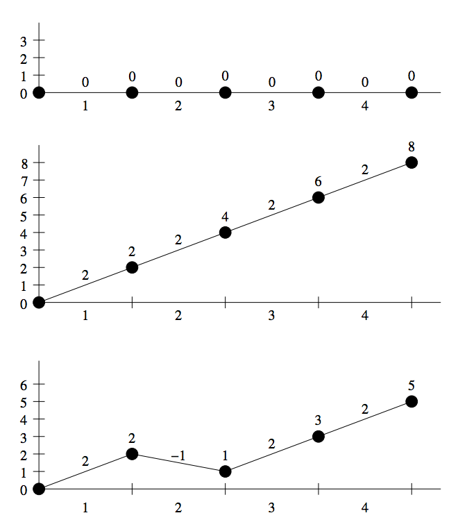

## 문제

The Mountain Amusement Park has opened a brand-new simulated roller coaster. The simulated track consists of n rails attached end-to-end with the beginning of the first rail fixed at elevation 0. Byteman, the operator, can reconfigure the track at will by adjusting the elevation change over a number of consecutive rails. The elevation change over other rails is not affected. Each time rails are adjusted, the following track is raised or lowered as necessary to connect the track while maintaining the start at elevation 0. The figure on the next page illustrates two example track reconfigurations.

Each ride is initiated by launching the car with sufficient energy to reach height h. That is, the car will continue to travel as long as the elevation of the track does not exceed h, and as long as the end of the track is not reached.

Given the record for all the day’s rides and track configuration changes, compute for each ride the number of rails traversed by the car before it stops.

Internally, the simulator represents the track as a sequence of n elevation changes, one for each rail. The i-th number di represents the elevation change (in centimetres) over the i-th rail. Suppose that after traversing i−1 rails the car has reached an elevation of h centimetres. After traversing i rails the car will have reached an elevation of h+di centimetres.

Initially the rails are horizontal; that is, di = 0 for all i. Rides and reconfigurations are interleaved throughout the day. Each reconfiguration is specified by three numbers: a, b and D. The segment to be adjusted consists of rails a through b (inclusive). The elevation change over each rail in the segment is set to D. That is, di = D for all a ≤ i ≤ b.

Each ride is specified by one number h — the maximum height that the car can reach.

Write a program that:

* reads from the standard input a sequence of interleaved reconfigurations and rides,
* for each ride computes the number of rails traversed by the car,
* writes the results to the standard output.

## 입력

The first line of input contains one positive integer n — the number of rails, 1 ≤ n ≤ 1 000 000 000. The following lines contain reconfigurations interleaved with rides, followed by an end marker. Each line contains one of:

* Reconfiguration — a single letter ‘I’, and integers a, b and D, all separated by single spaces (1 ≤ a ≤ b ≤ n, −1 000 000 000 ≤ D ≤ 1 000 000 000).
* Ride — a single letter ‘Q’, and an integer h (0 ≤ h ≤ 1 000 000 000) separated by a single space;
* A single letter ‘E’ — the end marker, indicating the end of the input data.

You may assume that at any moment the elevation of any point in the track is in the interval [0, 1 000 000 000] centimetres. The input contains no more than 100 000 lines.

In 50 % of test cases n satisfies 1 ≤ n ≤ 20 000 and there are no more than 1 000 lines of input.

## 출력

The i-th line of output should consist of one integer — the number of rails traversed by the car during the i-th ride.

## 힌트

Views of the track before and after each reconfiguration. The x axis denotes the rail number. The y axis and the numbers over points denote elevation. The numbers over segments denote elevation changes.
