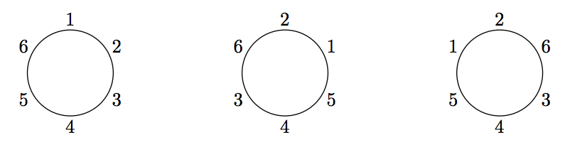

## 문제

It is Byteman’s birthday today. There are n children at his birthday party (including Byteman). The children are numbered from 1 to n. Byteman’s parents have prepared a big round table and they have placed n chairs around the table. When the children arrive, they take seats. The child number 1 takes one of the seats. Then the child number 2 takes the seat on the left. Then the child number 3 takes the next seat on the left, and so on. Finally the child number n takes the last free seat, between the children number 1 and n−1 .

Byteman’s parents know the children very well and they know that some of the children will be noisy, if they sit too close to each other. Therefore the parents are going to reseat the children in a specific order. Such an order can be described by a permutation p1, p2,..., pn (p1, p2,..., pn are distinct integers from 1 to n) — child p1 should sit between pn and p2, child pi (for i = 2 ,3 ,...,n−1 ) should sit between pi−1 and pi+1, and child pn should sit between pn−1 and p1. Please note, that child p1 can sit on the left or on the right from child pn.

To seat all the children in the given order, the parents must move each child around the table to the left or to the right some number of seats. For each child, they must decide how the child will move — that is, they must choose a direction of movement (left or right) and distance (number of seats). On the given signal, all the children stand up at once, move to the proper places and sit down.

The reseating procedure throws the birthday party into a mess. The mess is equal to the largest distance any child moves. The children can be reseated in many ways. The parents choose one with minimum mess. Help them to find such a way to reseat the children.

Your task is to write a program that:

* reads from the standard input the number of the children and the permutation describing the desired order of the children,
* determines the minimum possible mess,
* writes the result to the standard output.

## 입력

The first line of standard input contains one integer n (1 ≤ n ≤ 1 000 000 ). The second line contains n integers p1, p2,..., pn, separated by single spaces. Numbers p1, p2,..., pn form a permutation of the set {1 ,2 ,...,n} describing the desired order of the children. Additionally, in 50% of the test cases, n will not exceed 1 000.

## 출력

The first and the only line of standard output should contain one integer: the minimum possible mess.

## 힌트

The left figure shows the initial arrangement of the children. The middle figure shows the result of the following reseating: children number 1 and 2 move one place, children number 3 and 5 move two places, and children number 4 and 6 do not change places. The conditions of arrangement are fulfilled, since 3 sits between 6 and 4, 4 sits between 3 and 5, 5 sits between 4 and 1, 1 sits between 5 and 2, 2 sits between 1 and 6, and 6 sits between 2 and 3. There exists another possible final arrangement of children, depicted in the right figure. In both cases no child moves more than two seats.
