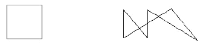

## 문제

Little Joey invented a scrabble machine that he called Euler, after the great mathematician. In his primary school Joey heard about the nice story of how Euler started the study about graphs. The problem in that story was - let me remind you - to draw a graph on a paper without lifting your pen, and finally return to the original position. Euler proved that you could do this if and only if the (planar) graph you created has the following two properties: (1) The graph is connected; and (2) Every vertex in the graph has even degree.

Joey's Euler machine works exactly like this. The device consists of a pencil touching the paper, and a control center issuing a sequence of instructions. The paper can be viewed as the infinite two-dimensional plane; that means you do not need to worry about if the pencil will ever go off the boundary.

In the beginning, the Euler machine will issue an instruction of the form (X0, Y0) which moves the pencil to some starting position (X0, Y0). Each subsequent instruction is also of the form (X', Y'), which means to move the pencil from the previous position to the new position (X', Y'), thus draw a line segment on the paper. You can be sure that the new position is different from the previous position for each instruction. At last, the Euler machine will always issue an instruction that move the pencil back to the starting position (X0, Y0). In addition, the Euler machine will definitely not draw any lines that overlay other lines already drawn. However, the lines may intersect.

After all the instructions are issued, there will be a nice picture on Joey's paper. You see, since the pencil is never lifted from the paper, the picture can be viewed as an Euler circuit.

Your job is to count how many pieces (connected areas) are created on the paper by those lines drawn by Euler.

## 입력

There are no more than 25 test cases. Ease case starts with a line containing an integer N >= 4, which is the number of instructions in the test case. The following N pairs of integers give the instructions and appear on a single line separated by single spaces. The first pair is the first instruction that gives the coordinates of the starting position. You may assume there are no more than 300 instructions in each test case, and all the integer coordinates are in the range (-300, 300). The input is terminated when N is 0.

## 출력

For each test case there will be one output line in the format

Case x: There are w pieces.,

where x is the serial number starting from 1.

Note: The figures below illustrate the two sample input cases.

