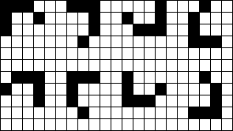
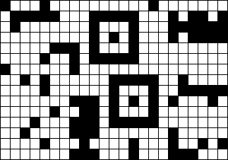
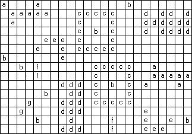

## 문제

High up in the night sky, the shining stars appear in clusters of various shapes. A cluster is a non-empty group of neighbouring stars, adjacent in horizontal, vertical or diagonal direction. A cluster cannot be a part of a larger cluster.

Clusters may be similar. Two clusters are similar if they have the same shape and number of stars, irrespective of their orientation. In general, the number of possible orientations for a cluster is eight, as Figure 1 exemplifies.

Figure 1. Eight similar clusters

The night sky is represented by a sky map, which is a two-dimensional matrix of 0's and 1's. A cell contains the digit 1 if it has a star, and the digit 0 otherwise.

Given a sky map, mark all the clusters with lower case letters. Similar clusters must be marked with the same letter; non-similar clusters must be marked with different letters.

You mark a cluster with a lower case letter by replacing every 1 in the cluster by that lower case letter.

## 입력

In standard input the first two lines contain, respectively, the width W and the height H of a sky map. The sky map is given in the following H lines, of W characters each.

* 0 <= W (width of the sky map) <= 100
* 0 <= H (height of the sky map) <= 100
* 0 <= Number of clusters <= 500
* 0 <= Number of non-similar clusters <= 26 (a..z)
* 1 <= Number of stars per cluster <= 160

## 출력

The standard output contains the same map as standard input, except that the clusters are marked as described in Task.

## 힌트

In this case, the sky map has width 23 and height 15. Just to make it clearer, notice that this input file corresponds to the following picture of the sky.

Figure 2. Picture of the sky

This is one possible result for the sample input above. Notice that this output file corresponds to the following picture.

Figure 3. Picture with the clusters marked
