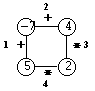
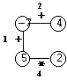
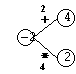
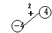

## 문제

Polygon is a game for one player that starts on a polygon with N vertices, like the one in Figure 1, where N=4. Each vertex is labelled with an integer and each edge is labelled with either the symbol + (addition) or the symbol \* (product). The edges are numbered from 1 to N.

Figure 1. Graphical representation of a polygon

On the first move, one of the edges is removed.

Subsequent moves involve the following steps:

* pick an edge E and the two vertices V\_1 and V\_2 that are linked by E; and
* replace them by a new vertex, labelled with the result of performing the operation indicated in E on the labels of V\_1 and V\_2.

The game ends when there are no more edges, and its score is the label of the single vertex remaining.

Consider the polygon of Figure 1. The player started by removing edge 3. The effects are depicted in Figure 2.

Figure 2. Removing edge 3

After that, the player picked edge 1,

Figure 3. Picking edge 1

then edge 4,

Figure 4. Picking edge 4

and, finally, edge 2. The score is 0.

Figure 5. Picking edge 2

Write a program that, given a polygon, computes the highest possible score and lists all the edges that, if removed on the first move, can lead to a game with that score.

## 입력

Standard input describes a polygon with N vertices. It contains two lines.

On the first line is the number N.

The second line contains the labels of edges 1, ..., N, interleaved with the vertices' labels (first that of the vertex between edges 1 and 2, then that of the vertex between edges 2 and 3, and so on, until that of the vertex between edges N and 1), all separated by one space. An edge label is either the letter t (representing +) or the letter x (representing \*).

## 출력

On the first line of standard output your program must write the highest score one can get for the input polygon.

On the second line it must write the list of all edges that, if removed on the first move, can lead to a game with that score.

Edges must be written in increasing order, separated by one space.
