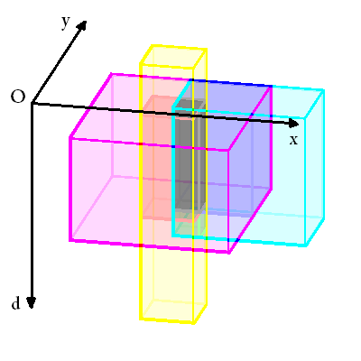

## 문제

해양 연구원 상근이는 동해에 서식하고 있는 N 종류의 물고기의 특성에 대해 연구하고 있다.

각 물고기가 서식할 수 있는 구역은 직육면체 모양이다. 물고기는 서식 범위의 경계를 포함해서 모든 곳을 자유롭게 이동할 수 있지만, 절대로 그 범위의 밖으로 나오지 않는다.

바다의 점은 3개 실수 (x, y, d)로 표현한다. 상공에서 볼 때, 어떤 지점을 기준으로 동쪽으로 x, 북쪽으로 y만큼 떨어진 곳에서 해수면에서 깊이가 d점인 점을 나타낸다. 바다는 평면이라고 가정한다.

상근이는 물고기가 K 종류 이상 서식하는 범위를 구하려고 한다. 그러한 위치의 부피를 구하는 프로그램을 작성하시오.

## 입력

첫째 줄에 N과 K가 주어진다. (1 ≤ K ≤ N ≤ 50)

둘째 줄부터 N개 줄에 물고기의 서식범위를 나타내는 6개의 정수 Xi,1 Yi,1 Di,1 Xi,2 Yi,2 Di,2가 주어진다. (0 ≤ Xi,1 < Xi,2 ≤ 106, 0 ≤ Yi,1 < Yi,2 ≤ 106, 0 ≤ Di,1 < Di,2 ≤ 106) 물고기의 서식 구역은 (Xi,1, Yi,1, Di,1), (Xi,2, Yi,1, Di,1), (Xi,2, Yi,2, Di,1), (Xi,1, Yi,2, Di,1), (Xi,1, Yi,1, Di,2), (Xi,2, Yi,1, Di,2), (Xi,2, Yi,2, Di,2), (Xi,1, Yi,2, Di,2)를 꼭짓점으로 하는 직육면체이다.

## 출력

첫째 줄에 K 종류 이상의 물고기가 서식하는 구역의 부피를 출력한다.

## 힌트

