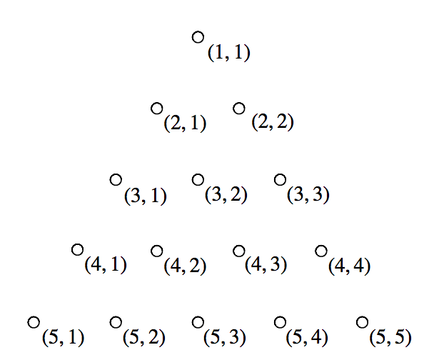
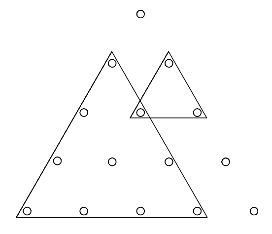

## 문제

JOI くんは板に釘を刺して遊んでいる．下図のように，JOI くんは一辺 N 本の正三角形の形に釘を並べて刺した．上から a 行目 (1 ≤ a ≤ N) には a 本の釘が並んでいる．そのうち左から b 本目 (1 ≤ b ≤ a) の釘を (a, b) で表す．

図 1: 釘の並び方（N = 5 の場合）

釘を頂点とする正三角形が，「各辺が全体の正三角形の辺のいずれかと平行で，全体の正三角形と同じ向き」であるとき，この正三角形を「よい正三角形」と呼ぶ．すなわち，「よい正三角形」とは，3 本の釘 (a, b), (a + x, b), (a + x, b + x) を頂点とする正三角形のことである（ただし a, b, x は 1 ≤ a < N, 1 ≤ b ≤ a, 1 ≤ x ≤ N − a) をみたす）．

JOI くんは，輪ゴムを使って，「よい正三角形」の周りを囲うことにした．

図 2: 輪ゴムによる「よい正三角形」の囲い方の例

正三角形の一辺に並んでいる釘の本数 N と，JOI くんが持っている輪ゴムの数 M と，M 本の輪ゴムによる「よい正三角形」の囲い方が与えられたとき，1 本以上の輪ゴムで囲われた釘の本数を求めるプログラムを作成せよ．

## 입력

標準入力から以下のデータを読み込め．

* 1 行目には整数 N, M が空白を区切りとして書かれている．N は正三角形の一辺に並んでいる釘の本数を，M は JOI くんの持っている輪ゴムの数をそれぞれ表す．
* 続く M 行は輪ゴムによる「よい正三角形」の囲い方の情報を表す．i + 1 行目 (1 ≤ i ≤ M) には整数 Ai, Bi, Xi (1 ≤ Ai < N, 1 ≤ Bi ≤ Ai, 1 ≤ Xi ≤ N − Ai) が空白を区切りとして書かれている．これは，i本目の輪ゴムは 3 本の釘 (Ai, Bi), (Ai + Xi, Bi), (Ai + Xi, Bi + Xi) を頂点とする「よい正三角形」を囲っていることを表す．

## 출력

標準出力に，1 本以上の輪ゴムに囲われている釘の本数を 1 行で出力せよ．

## 힌트

この例は図 2 のような「よい正三角形」の囲い方に対応している．この例において，(1, 1), (4, 4), (5, 5)以外の 12 本の釘が 1 本以上の輪ゴムで囲われている．
