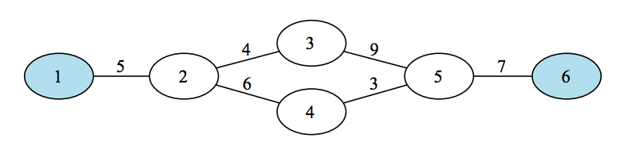
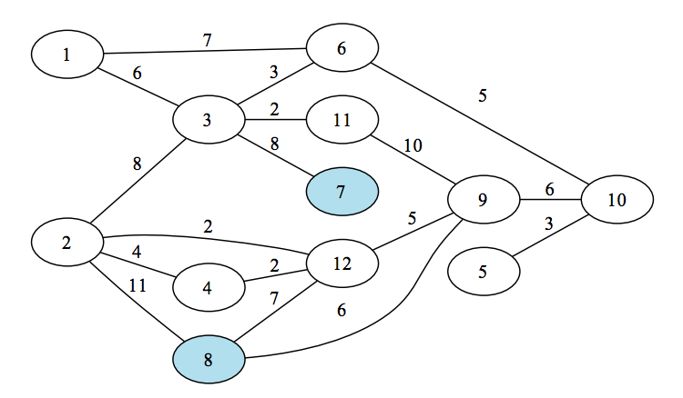

## 문제

JOI 국에는 N개의 도시가 있다. 이 도시들 사이에는 M개의 도로가 있는데 이 도로는 양방향으로 통행이 가능한 도로이다. 모든 도시들은 연결되어 있다.

현재 JOI국의 K개의 도시들에서 축제가 벌어지고 있다. JOI국의 국민들은 축제를 좋아하는 사람들도 있지만 그 분위기를 매우 싫어하는 국민들도 제법 있다.

축제를 싫어하는 사람 Q명이 도시들 사이를 이동하려고 한다. 출발도시와 도착도시가 주어질 때, 출발도시와 도착도시가 주어질 때, 이동하는 경로에 있는 도시들 중 축제하는 도시와 가장 가까운 도시와의 거리가 최대가 되도록 원하는 도시로 가는 방법을 구하여라. 단, 축제하는 도시와 임의의 도시와의 거리는 두 지점간의 최단경로로 계산한다.

## 입력

첫째 줄에 도시의 수 N, 도로의 수 M, 축제를 여는 도시의 수 K, 축제를 싫어하는 사람의 수 Q가 공백으로 구분되어 입력된다.

다음 줄부터 M줄에 걸쳐서 각 도로의 정보 출발점, 도착점, 거리가 공백으로 구분되어 입력된다. 거리는 1 이상 1000 이하이다.

다음 줄 부터 K줄에 걸쳐서 축제를 하는 도시의 번호가 한 줄에 하나씩 입력된다. 축제를 하는 도시의 번호는 중복되지 않는다.

다음 줄부터 Q줄에 걸쳐서 축제를 싫어하는 사람이 출발하는 출발지와 도착지가 한 줄에 하나씩 공백으로 구분되어 입력된다. 출발지와 도착지는 서로 다르다.

## 출력

Q줄에 걸쳐서 입력받은 순서대로 각 사람이 이동하는데 축제하는 도시와의 최대거리를 출력한다.

## 힌트

예제 1. 3에서 4로 가는 경우는 3-5-4로 이동하면 가장 가까운 축제가 6번이고 거리는 7이다. 이 값이 최대이고, 5에서 2로 가는 경우는 5-3-2, 5-4-2 모두 1번 축제와 거리 5가 되므로 이 값을 출력한다. 마지막으로 1에서 4로 가는 경우는 1이 축제지 이므로 축제지와의 최대거리는 0이된다.

예제 2.
