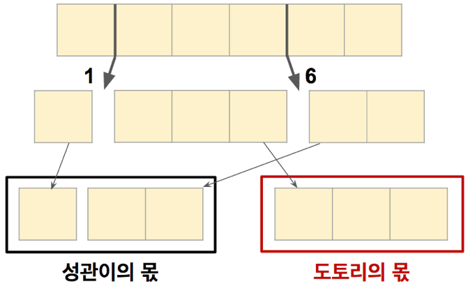

## 문제

길이가 N인 막대 모양 과자가 있다. 성관이와 도토리는 이 과자를 여러 조각으로 잘라 각자 합이 N/2가 되도록 나눠먹으려 한다. 이 과자는 무엇인지 모를 재료로 만들어졌기 때문에 각 지점마다 자를 때 필요한 힘이 다르다. 알고리즘 캠프를 하느라 너무 지친 성관이는 과자를 자르기 위해 많은 힘을 쓰고 싶지 않다. 과자의 각 위치를 절단하는데 얼마의 힘이 필요한지를 알 때, 두 사람이 과자를 나누기 위해 필요한 최소 힘의 합을 구해주자.

 예를 들어 길이 6인 과자가 있고, 각 지점을 자르는 데 필요한 힘이 왼쪽부터 {1, 8, 12, 6, 2}라면 이때 필요한 최소 힘은 다음과 같이 잘랐을 때의 합인 7이 된다.

## 입력

첫 줄에 과자의 길이 N(2 ≤ N ≤ 10,000)이 주어진다. 이때 N은 짝수이다. 두 번째 줄부터 N번째 줄까지 맨 왼쪽에서부터 각 지점을 자르는 데 필요한 힘 P(0 ≤ P ≤ 10,000)가 주어진다.

## 출력

한 줄에 필요한 최소 힘의 합을 출력하라.
