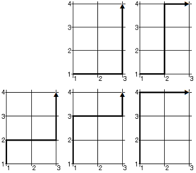

## 문제

상근이가 사는 도시는 남북 방향으로 도로가 w개, 동서 방향으로 도로가 h개 있다.

남북 방향 도로는 서쪽부터 순서대로 번호가 1, 2, ..., w로 매겨져 있다. 또, 동서 방향 도로는 남쪽부터 순서대로 번호가 1, 2, ..., h로 매겨져 있다. 서쪽에서 i번째 남북 방향 도로와 남쪽에서 j번째 동서 방향 도로가 만나는 교차로는 (i, j)이다.

상근이는 교차로 (1, 1)에 살고 있고, 교차로 (w, h)에 있는 회사에 차로 다니고 있다. 차는 도로로만 이동할 수 있다. 상근이는 회사에 최대한 빨리 가기 위해서, 동쪽 또는 북쪽으로만 이동할 수 있다. 또, 이 도시는 교통 사고를 줄이기 위해서 교차로를 돈 차량은 그 다음 교차로에서 다시 방향을 바꿀 수 없다. 즉, 교차로에서 방향을 바꾼 후, 1 블록만 이동한 후 다시 방향을 바꿀 수 없다.

상근이가 회사에 출근할 수 있는 경로의 수는 몇 가지 일까?

w와 h가 주어졌을 때, 가능한 출근 경로의 개수를 구하는 프로그램을 작성하시오.

## 입력

첫째 줄에 w와 h가 주어진다. (2 ≤ w, h ≤ 100)

## 출력

첫째 줄에 상근이가 출근할 수 있는 경로의 개수를 100000로 나눈 나머지를 출력한다.

## 힌트

예제 1의 경우 다음과 같은 5가지 경로가 있다.

