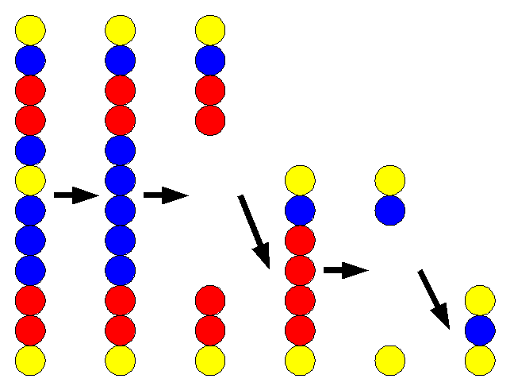

## 문제

세로로 N개의 공이 붙어있으며, 각 공의 색은 R(빨강), B(파랑), Y(노랑) 중 하나이다. 플레이어는 한 공의 색을 다른 색으로 바꿀 수 있다. 이러한 변환을 거쳐 동일한 색의 공이 4개 이상 연속되면 그 공들은 팡!하고 터진다. 이 공들이 팡!하고 터지고 난 뒤에는 공들이 위아래로 붙어 다시 연속된 세로열을 유지하며, 팡!하고 터진 후 붙으면서 다시 동일한 색의 공이 4개 이상 연속되면 연쇄적으로 팡!하고 터진다. 이 게임의 목적은 소멸하지 않고 남아있는 공의 수를 최소화하는 것이다. 단, 게임 시작시의 초기 상태에서 동일한 색의 공이 4개 이상 연속된 부분이 없다는 것은 보장된다.

예를 들어, 아래 그림의 왼쪽 상태에서 위에서 6번째 공의 색을 노랑에서 파랑으로 변경하면 파랑공 5개가 연속되므로 팡!하고 터진다. 이후 빨강공 4개가 연쇄적으로 팡!하고 터지므로 3개의 공이 소멸하지 않고 남게된다.

초기 상태에서 N개의 공의 색이 주어졌을 때, 1개 공의 색만 변경하여 연쇄적인 팡! 후에 남아있는 공의 최솟값 M을 구해보자.

## 입력

첫 번째 줄에 공의 수 N(1 ≦ N ≦ 10000)이 주어진다.

이어지는 N개의 줄에 공의 색에 대한 정보가 연속적으로 주어진다.

공의 색은 1, 2, 3 중 하나로 주어지며, 1은 빨강, 2는 파랑, 3은 노랑을 나타낸다.

## 출력

소멸하지 않고 남아있는 공의 최솟값 M을 출력한다.
