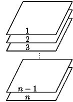
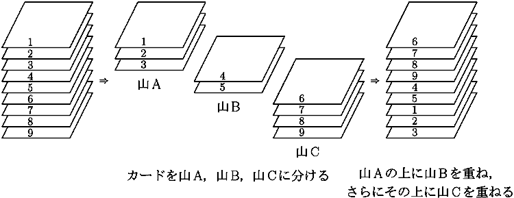

## 문제

1 から n までの番号が書かれた n 枚のカードがある． まず，一番上が番号 1 のカード，上から2枚目が番号 2 のカード，…，一番下が番号 n のカードとなるように順番に重ねて，カードの山を作る．

カードの山に対して， 「シャッフル(x,y)」と呼ばれる次のような操作を行うことで， カードを並び替える（x, y は 1 ≦ x ＜ y ＜ n をみたす整数）．

* シャッフル(x,y)
  + n 枚のカードを， 一番上から x 枚目までのカードからなる山A， x+1 枚目から y 枚目のカードからなる山B， y+1 枚目から n 枚目のカードからなる山C の3つの山に分ける． そして，山Aの上に山Bを重ね，さらにその上に山Cを重ねる．

例えば， 順番に並んでいる9枚のカードに対して「シャッフル(3,5)」を行うと， 9 枚のカードに書かれた番号は, 上から順番に 6, 7, 8, 9, 4, 5, 1, 2, 3 となる．

最初の山の状態から m 回のシャッフル「シャッフル(x1, y1)」「シャッフル(x2, y2)」 … 「シャッフル(xm, ym)」を順番に行った後のカードの山において，上から数えて p 枚目から q 枚目のカードの中に番号が r 以下のカードが何枚含まれているかを求めるプログラムを作成せよ．

## 입력

入力は m+3 行からなる． 1 行目にはカードの枚数 n が書かれている（3 ≦ n ≦ 1000000000 = 109）． 2 行目にはシャッフルの回数を表す整数 m が書かれている（1 ≦ m ≦ 5000）． 3 行目には整数 p, q, r が書かれている（1 ≦ p ≦ q ≦ n, 1 ≦ r ≦ n）． i + 3 行目（1 ≦ i ≦ m）には2つの整数 xi, yi (1 ≦ xi ＜ yi ＜ n) が空白を区切りとして書かれている．

## 출력

m 回のシャッフル後のカードの山において， 上から数えて p 枚目から q 枚目のカードの中に含まれている番号が r 以下のカードの枚数を出力せよ．

## 힌트

入力例1の山に対して, 「シャッフル(3,5)」を行うと， カードは上から順番に 6, 7, 8, 9, 4, 5, 1, 2, 3 となる． 上から数えて 3 枚目から 7 枚目に含まれる番号が 4 以下のカードは， 番号 4 と番号 1 の 2 枚である．

また， 入力例2の山に対して, 「シャッフル(3,8)」「シャッフル(2,5)」「シャッフル(6,10)」を順番に行うと， カードは上から順番に 9, 10, 3, 11, 12, 4, 5, 6, 7, 8, 1, 2 となる． 上から数えて 3 枚目から 8 枚目に含まれる番号が 5 以下のカードは 3 枚である．
