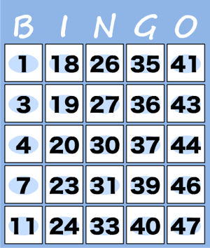

## 문제

어떤 프로그래밍 대회에서는 경기를 끝마치고 나면 뒤풀이로 빙고 게임을 하는 이상한 관습이 있다고 합니다. 하지만 이 빙고 게임에서 사용되는 "빙고 표"는 보통 빙고 게임과 다르게 밑에 있는 조건에 따라 빈 칸을 채워야 합니다.

* 빙고 표는 N 행 N열의 숫자 칸으로 나눠져있으며 각 숫자 칸에는 정수 1개가 적혀 있습니다. 적힌 정수는 모두 달라야 합니다.
* 숫자 칸에 적혀 있는 정수는 1 이상 M 이하입니다.
* 빙고 표에 적혀 있는 N × N개의 정수의 합은 S입니다.
* 모든 줄에서 위에서 아래로 보면 숫자들이 오름차순으로 정렬되어 있어야 합니다.
* 숫자 칸에 적혀있는 정수는 자신의 왼쪽 방향 줄에 있는 모든 정수보다 큰 값이어야 합니다.

아래 그림은 N = 5, M = 50, S = 685일 때 빙고 표 배치로 나올 수 있는 예입니다.

뒤풀이에 참석하고 싶어하는 사람이 많기 때문에 될 수 있는 한 많은 빙고 표를 만들려고 합니다. 하지만 모든 사람들은 자신만의 빙고 표를 갖고 싶어합니다. 그러므로 같은 빙고 표를 2개 이상 만들어선 안 됩니다. 만들 수 있는 빙고 표 개수의 최댓값을 100,000으로 나눈 값을 출력하는 프로그램을 작성하세요.

## 입력

입력은 1줄입니다. 그 줄에는 각각 빙고 표의 크기 N(1 ≤ N ≤ 7)과 숫자 칸에 적혀 있는 정수들의 최댓값 M(1 ≤ M ≤ 2000), 빙고 표에 적혀 있는 정수의 합계인 S(1 ≤ S ≤ 3000)을 나타내는 3개의 정수가 공백으로 구분되어 주어집니다.

주어지는 모든 입력 데이터에 대해서, 조건을 만족하는 빙고 표를 적어도 1개 이상 만드는 것이 가능합니다.

## 출력

만들 수 있는 빙고 표 개수의 최댓값을 100,000으로 나눈 값을 출력하세요.

## 힌트

예제 입력 3을 예로 들면 만들 수 있는 빙고 표의 최대 개수는 642499974501개이고, 이를 100,000으로 나누면 74501이 됩니다.
