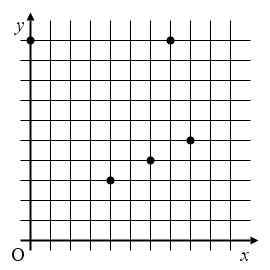
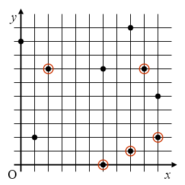

## 문제

상근이는 밤하늘 사진에서 별자리를 찾고 있다. 사진에는 꼭 찾고 싶은 별자리와 같은 형태, 방향, 크기의 도형이 한 개가 포함되어 있다. 하지만, 상근이가 가지고 있는 사진 속에는 별자리를 구성하는 별 이외에 다른 별도 찍혀 있다.

왼쪽 그림은 상근이가 찾고자하는 별자리이다. 오른쪽 그림은 상근이가 가지고 있는 별자리 사진이고, 상근이가 찾은 별자리의 별은 동그라미가 쳐져 있다. 주어진 별자리의 별 좌표를 x방향으로 2, y방향으로 -3만큼 평행 이동하면 사진 속 위치가 된다.

꼭 찾고 싶은 별자리의 모양과, 사진에 찍힌 별의 위치가 주어졌을 때, 별자리 좌표를 사진 속 좌표로 변환하기 위해 변환해야 하는 양을 구하는 프로그램을 작성하시오.

## 입력

첫째 줄에 찾고 싶은 별자리를 구성하는 별의 개수 m이 주어진다. 다음 m개 줄에는 별자리를 구성하는 별의 x좌표와 y좌표가 주어진다. 다음 줄에는 사진의 별의 개수 n이 주어진다. 다음 n개 줄에는 사진에 있는 별의 x좌표와 y좌표가 주어진다. (1 ≤ m ≤ 200, 1 ≤ n ≤ 1000) 별의 x 좌표와 y좌표는 0 이상, 1000000 이하이다.

## 출력

첫째 줄에 찾고 싶은 별자리 좌표를 얼마나 평행 이동하면 사진 속의 좌표가 되는지를 출력한다. 첫 번째 정수는 x 방향으로 평행 이동하는 양이고, 두 번째 정수는 y 방향으로 평행 이동하는 양이다.
