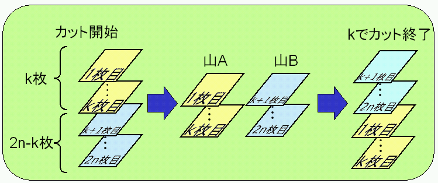
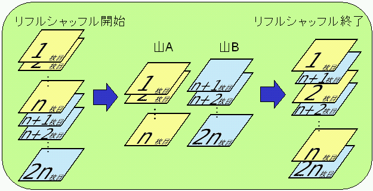

## 문제

1 から 2n の数が書かれた 2n 枚のカードがあり， 上から 1, 2, 3, ... , 2n の順に積み重なっている．

このカードを， 次の方法を何回か用いて並べ替える．

**整数 k でカット**

上から k 枚のカードの山 A と 残りのカードの山 B に分けた後， 山 A の上に山 B をのせる．

**リフルシャッフル**

上から n 枚の山 A と残りの山 B に分け， 上から A の1枚目， B の1枚目， A の2枚目， B の2枚目， …， A の n枚目， B の n枚目， となるようにして， 1 つの山にする．

入力ファイルの指示に従い， カードを並び替えたあとのカードの番号を， 上から順番に出力するプログラムを作成せよ．

## 입력

* 1 行目には n （1 ≦ n ≦ 100）が書かれている． すなわちカードの枚数は 2n 枚である．
* 2 行目には操作の回数 m （1 ≦ m ≦ 1000）が書かれている．
* 3 行目から m + 2 行目までの m 行には， 0 から 2n-1 までのいずれか 1 つの整数 k が書かれており， カードを並べ替える方法を順に指定している．
  + k = 0 の場合は， リフルシャッフルを行う．
  + 1 ≦ k ≦ 2n-1 の場合は， k でカットを行う．

## 출력

2n 行からなる出力ファイルを提出せよ． 1 行目には並べ替え終了後の一番上のカードの番号， 2 行目には並べ替え終了後の上から 2 番目のカードの番号というように， i 行目には上から i 番目のカードの番号を出力せよ．
