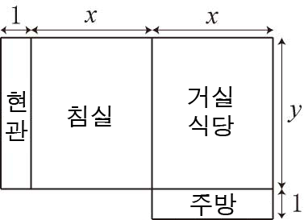

## 문제

동규부동산에서 아파트를 임대하고 있다. 아파트의 방은 아래 그림과 같이 면적이 2xy + x + y이다. (x와 y는 양의 정수)

동규부동산의 카탈로그에는 아파트의 면적이 오름차순으로 적혀져 있지만, 이 중 일부는 있을 수 없는 크기의 아파트이다. 만약, 이런 크기의 아파트를 임대하겠다고 말하면, 동규는 꽝! 이라고 외치면서, 수수료만 떼어간다.

동규부동산의 카탈로그에 적힌 아파트의 면적이 주어졌을 때, 있을 수 없는 크기의 아파트의 수를 구하는 프로그램을 작성하시오.

## 입력

첫째 줄에 아파트의 면적의 수 N이 주어진다. 다음 줄부터 N개 줄에 카탈로그에 적혀있는 순서대로 면적이 주어진다. N은 100,000이하이고 면적은 231-1이하인 양의 정수이다.

## 출력

첫째 줄에 있을 수 없는 아파트 면적의 수를 출력한다.
