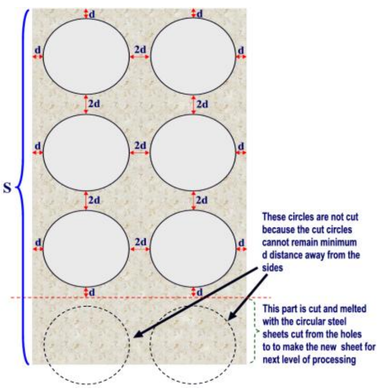

## 문제

The City of Haka is very famous for its traffic jam. This has given birth to many problemsetters (Those who pose questions for programming contests) as in traffic jam some people have nothing meaningful to do other than thinking about new problems. Most wide roads in Haka have fence along the divider. Perforated steel sheets (As shown in the figure on the left) are often used in these fences.

In this problem we will discuss the manufacturing process of one kind of perforated steel strips and ask you to solve a problem related to this building process.

For this problem the rectangular perforated steel strips have two circular holes in each row. Circular holes in the same row are 2d distance apart. Two consecutive circular holes in the same column are also 2d distance apart. The distance of each circle from its nearest side is d. The radius of all the circles is r. So automatically the width of the metal sheet/strip becomes (4d + 4r). The length of the initial sheet is S. Such a sheet with holes in it is shown in the picture on the right. Holes are only drilled if they can be cut according to rules mentioned above. The circular steel sheets which are obtained by cutting the holes and part of the sheet that is unused (Such as portion below the red dotted line in the figure on the right) are melted to create a new steel sheet/strip of width (4d+ 4r). Now holes are cut according to the rules mentioned above. This process is repeated until the newly created sheet is so small that two holes (In the same row) cannot be created in it following the above-mentioned restrictions. Suppose C(d, r, S) denote the total number of holes that are created. Now given the minimum possible value of r (rmin), maximum possible value of r (rmax), minimum possible value of d (dmin) and maximum possible value of d (dmax) you will have to find the total number of holes created.

In other words you will have to find

\( \sum\_{r=r\_{min}}^{r\_{max}}\sum\_{d=d\_{min}}^{d\_{max}} C(d,r,S) \)

It should be clear to you now that the value of d and r are always integer. Your method should be quite efficient. You must assume that the initial given strip and the strips created later on have equal and uniform thickness in all places.

## 입력

Input file contains 1000 sets of inputs. The input for each set is given in a single line. Each line contains five integers rmin (5, 000 ≤ rmin ≤ 10, 000), rmax (0 ≤ rmax − rmin ≤ 1, 000) , dmin (1 ≤ dmin ≤ 21), dmax (0 ≤ dmax − dmin ≤ 100) and S (1, 000, 000 ≤ S ≤ 2, 000, 000, 000). By now it should be clear to you that value of r and d can only be a round number.

Input is terminated by a line containing five zeroes. This line should not be processed.

## 출력

For each set/line of input produce one line of output. This line contains an integer, which denotes the value of

\( \sum\_{r=r\_{min}}^{r\_{max}}\sum\_{d=d\_{min}}^{d\_{max}} C(d,r,S) \)

You can safely assume that the value of this integer will comfortably fit in a 64-bit signed integer. Errors not exceeding 10−7% will be ignored.
