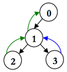

## 문제

간선에 방향성이 있는 트리(사이클이 없는 연결 그래프)가 주어진다. 트리에 특별 경로를 가능한 적게 추가해서, 모든 노드에서 다른 노드로 이동할 수 있게 하는 프로그램을 작성하시오.

특별 경로는 아래와 같은 규칙을 지켜야 한다.

1. 특별 경로는 연속된 간선과 정점으로 이루어져 있어야 한다.
2. 특별 경로의 모든 간선은 원래 트리에 있던 간선과 반대 방향이어야 한다.
3. 특별 경로에서 모든 노드와 간선은 최대 1번 방문할 수 있다.
4. 두 개 이상의 특별 경로가 같은 노드나 간선을 공유할 수 있다.

아래 트리를 살펴보자. 검정 간선은 원래 트리의 간선을 나타내고, 동그라미는 노드를 나타낸다. 그 다음, 두 개의 특별 경로 2-1-0(초록색)과 3-1(파란색)를 추가한다. 3-1대신에 3-1-0을 추가해도 된다. 하지만, 1-3이나 0-1-2는 규칙 2 때문에 추가할 수 없고, 0-2와 2-3-0은 규칙 1 때문에 추가할 수 없다.

## 입력

첫째 줄에 테스트 케이스의 개수 T(≤30)이 주어진다.

각 테스트 케이스의 첫째 줄에는 노드의 수 N이 주어진다. (2 ≤ N ≤ 20000) 노드는 0번부터 N-1번까지 번호가 매겨져 있다. 다음 N-1줄에는 간선 정보를 나타내는 u와 v가 주어진다. (0 ≤ u, v < N, u ≠ v) u에서 v로 향하는 간선이라는 뜻이다.

## 출력

각 테스트 케이스에 대해서, 케이스 번호와 모든 노드가 서로 연결될 수 있게 하기 위해서 추가해야 하는 특별 경로 개수의 최솟값을 출력한다.
