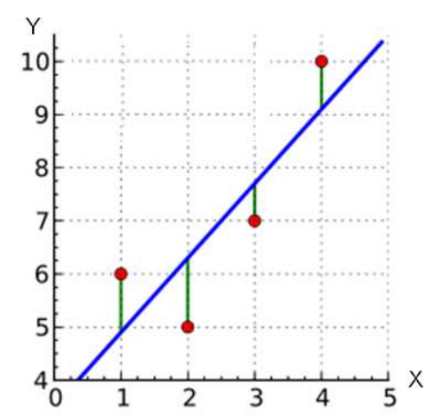

## 문제

Finding a line of best fit for a set of data is one of fundamental problems in statistics and numerical analysis. The problem can be formulated as follows. Suppose our data consists of a set P of n points in a plane, denoted (x1, y1), (x2, y2), (x3, y3), ..., (xn, yn). Given a line L defined by the linear equation y = ax + b, we say that the error of L with respect to P is the sum of its squared “distance” to the points in P :

\[Error(L,P) = \sum\_{i=1}^{n}{(y\_i - ax\_i - b)^2}\]

The least square approach is to find the line L which minimizes such error. Your task is to write a program to find the values a and b of the line L for a given set of points P.

Figure 1. Example of points and a line of best fit

## 입력

the first line contains a positive integer n (1 ≤ n ≤ 1,000). The next n lines contain 2 integers: xi and yi in each line. |xi| ≤ 106 and |yi| ≤ 106

## 출력

The output contains the values a and b in two lines respectively. The numbers must be rounded to 3 decimal places.
