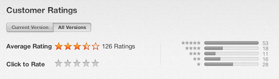

## 문제

아이폰 앱스토어에는 사용자들이 앱에 평점을 매길 수 있는 기능이 있다. 사용자는 별 한 개부터 다섯 개까지 평점을 매길 수 있다. 이러한 사용자의 평점이 모이면, 앱스토어는 그림과 같은 사용자 평점의 평균을 보여준다.

예를 들어, 사용자 세 명이 별 3개, 4개, 4개를 평가했으면, 평균 평점은 (3+4+4)/3 = 3.67 (소수점 셋째 자리에서 반올림) 이 된다.

위의 그림과 같이 총 126명이 평점을 매겼다면, 평균 평점은 \(\frac{53 \times 5+18 \times 4+ 11 \times 3 + 16 \times 2 + 28 \times 1}{126}=3.4126984\) (소수점 여덟째 자리에서 반올림) 이 된다.

상근이는 앱을 만들 때 마다 자신의 앱을 평가한 사람의 수와 각각의 별을 평가한 사람의 수, 평균 평점을 소수점 n(0 < n < 9)자리까지 데이터베이스에 저장해놨다. 어느 날, 선영이는 상근이의 데이터베이스를 해킹했고, 평균 평점을 제외한 모든 정보를 삭제해버렸다.

남은 정보는 평균 평점 뿐이다. 이 정보를 이용해서 그러한 평균 평점을 만들려면 최소 몇 명이 앱을 평가해야 하는지를 구하는 프로그램을 작성하시오.

## 입력

입력은 여러 줄로 이루어져 있다. (최대 2000줄) 각 줄은 음이 아닌 소수점 v (1 ≤ v ≤ 5)가 주어진다. v는 소수점 최소 한 자리, 최대 여덟 자리이다. v은 n자리 바로 다음 자리에서 반올림한 값이다.

입력의 마지막 줄에는 음수가 주어진다.

## 출력

입력으로 주어지는 평균 평점마다 그러한 평균 평점을 만들기 위해 최소 몇 명이 필요한지 출력한다.
