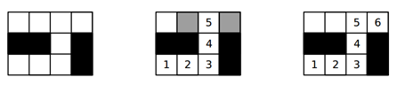

## 문제

The Game of Tiles is a game for two players played over a rectangular board in the form of a table of R rows and C columns of square cells called tiles. At the beginning of the game, some of the tiles may be painted black and the rest remain white. Then, Player 1 and Player 2 alternate turns making a move and the first one that cannot make a valid move loses the game. The first move of the game is done by Player 1 and consists of choosing a white tile and writing the number 1 on it. After that, each subsequent move i consists of writing number i on an unused white tile that is adjacent horizontally or vertically (but not diagonally) to the tile numbered i − 1. Note that Player 1 always writes odd numbers and Player 2 always writes even numbers.

The following figure shows three examples of possible configurations of a board with R = 3 and C = 4 during a game. On the left it shows the initial configuration. On the center it shows an intermediate state, where cells in gray mark the possible moves for Player 2. And on the right it shows the configuration when the game is won by Player 2, who chose the appropriate move.

Your task is to write a program that given the initial configuration of the board, determines which player will win, if both of them play optimally.

## 입력

Each test case is described using several lines. The first line contains two integers R and C representing respectively the number of rows and columns of the board (1 ≤ R, C ≤ 50). The i-th of the next R lines contains a string Bi of C characters that describes the i-th row of the initial board. The j-th character of Bi is either “.” (dot) or the uppercase letter “X”, representing that the tile at row i and column j is respectively white or black. Within each test case at least one of the tiles is white.

## 출력

For each test case output a line with an integer representing the number of the player (1 or 2) who will win the game if both of them play optimally.
