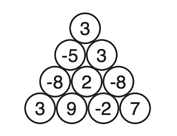

## 문제

KDK방송국은 새로운 게임 쇼를 하나 만들었다. 참가자는 선택을 몇 개 하게 되고, 이 선택에 따라서 상품을 얻게 된다.

먼저, 공이 삼각형 모양으로 쌓여져 있고, 각 공에는 정수 값이 하나씩 쓰여 있다. 아래 그림은 한 예이다.

참가자는 공을 고를 수 있고, 고른 공에 쓰여 있는 숫자의 합이 점수가 된다. 공을 고르면, 그 공은 삼각형에서 제거된다. 점수가 높을수록 좋은 상품을 받게 된다. 하지만, 참가자는 그 공의 위에 있는 공을 고른 경우에만 그 공을 고를 수 있다. 또, 참가자는 공을 고를 것인지, 게임을 중단할 것인지 선택할 수 있다. 만약, 공을 하나도 고르지 않은 경우에 점수는 0이 된다.

프로그램 PD 김동규는 참가자들이 얻을 수 있는 점수의 최댓값을 구해보려고 한다. 점수의 최댓값은 몇 점일까?

## 입력

입력은 여러 개의 테스트 케이스로 이루어져 있다. 각 테스트 케이스의 첫째 줄에는 공이 총 몇 행으로 쌓여져 있는지가 주어진다. 이 값을 N이라고 한다. (1 ≤ N ≤ 1000) 다음 N개의 줄의 i번째 줄에는 총 i개의 정수 Bij가 주어진다. (-105 ≤ Bij ≤ 105, 1 ≤ j ≤ i ≤ N) Bij는 i행 j열에 있는 공에 쓰여 있는 정수이다. (첫 행은 가장 윗 행, 각 행의 첫 번째 공은 가장 왼쪽 공)

입력의 마지막 줄에는 0이 하나 주어진다.

## 출력

각 테스트 케이스에 대해서, 참가자가 얻을 수 있는 점수의 최댓값을 출력한다.
