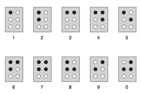

## 문제

The Braille system, designed by Louis Braille in 1825, revolutionized written communication for blind and visually impaired persons. Braille, a blind Frenchman, developed a tactile language where each element is represented by a cell with six dot positions, arranged in three rows and two columns. Each dot position can be raised or not, allowing for 64 different configurations which can be felt by trained fingers. The figure below shows the Braille representation for the decimal digits (a black dot indicates a raised position).

In order to develop a new software system to help teachers to deal with blind or visual impaired students, a Braille dictionary module is necessary. Given a message, composed only by digits, your job is to translate it to or from Braille. Can you help?

## 입력

Each test case is described using three or five lines. The first line contains an integer D representing the number of digits in the message (1 ≤ D ≤ 100). The second line contains a single uppercase letter ‘S’ or ‘B’. If the letter is ‘S’, the next line contains a message composed of D decimal digits that your program must translate to Braille. If the letter is ‘B’, the next three lines contain a message composed of D Braille cells that your program must translate from Braille. Braille cells are separated by single spaces. In each Braille cell a raised position is denoted by the character ‘\*’ (asterisk), while a not raised position is denoted by the character ‘.’ (dot).

The last test case is followed by a line containing one zero.

## 출력

For each test case print just the digits of the corresponding translation, in the same format as the input (see the examples for further clarification).
