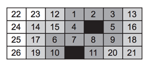

## 문제

You are going to construct a new factory in your city. Since you have major electric needs, having the factory placed close to a power plant is important. You want to build a prioritized list of possible locations.

The area in which the factory needs to be located can be represented as a rectangular grid of N rows and M columns of cells. Some of those cells contain a power plant. The new factory occupies exactly one cell, and can be placed in any empty cell (i.e., any cell that does not contain a power plant).

Numbering rows from 1 to N and columns from 1 to M, the location of a cell can be described by two integers. Cell (i, j) is the cell in row i and column j. The distance between cell (i0, j0) and cell (i1, j1) is max(|i0 − i1|, |j0 − j1|) where |x| represents the absolute value of x. The electric priority of a location is its minimum distance to a power plant.

With this in mind, you will number all possible locations with consecutive integers starting from 1. You will do it in ascending order of electric priority. Among locations with the same electric priority, you will number them in ascending order of their row numbers. Among locations with the same electric priority and row number, you will list them in ascending order of column numbers.

In the following picture you can see a 4 × 7 grid. Black cells are the cells in which there is a power plant. Dark gray cells have an electric priority of 1, light gray cells an electric priority of 2 and white cells an electric priority of 3. The number inside each cell is the number assigned by you to the location.

You will receive several queries about the prioritized list built. In each query you will be given a number representing a position in the prioritized list and you have to calculate which location was assigned the given position.

## 입력

Each test case is given using several lines. The first line contains three integers N, M and P, representing the number of rows and columns of the grid (1 ≤ N, M ≤ 109) and the number of existing power plants (1 ≤ P ≤ 20). Each of the next P lines contains two integers R and C representing the row and column numbers of the location of a power plant (1 ≤ R ≤ N and 1 ≤ C ≤ M). Within each test case, all power plant locations are different. The next line contains a single integer Q representing the number of queries (1 ≤ Q ≤ 50). Then follows a line with Q integers p1, ..., pQ representing positions in the prioritized list (1 ≤ pi ≤ N×M−P).

The last test case is followed by a line containing three zeros.

## 출력

For each test case output Q + 1 lines. Line i of the first Q lines must contain two integers representing the row and column numbers of the location that was assigned number pi. The last line for each test case must contain a single character ‘-’ (hyphen).
