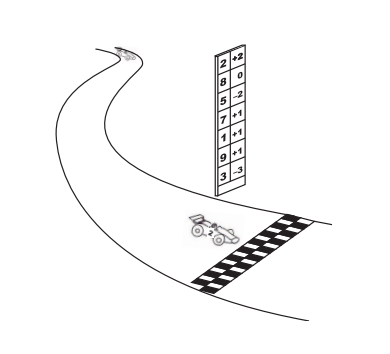

## 문제

In car races, there is always a high pole next to the finish line of the track. Before the race starts, the pole is used to display the starting grid. The number of the first car in the grid is displayed at the top of the pole, the number of the car in second place is shown below that, and so on.

During the race, the pole is used to display the current position of each car: the car that is winning the race has its number displayed at the top of the pole, followed by the car that is in second place, and so on.

Besides showing the current position of a car, the pole is also used to display the number of positions the cars have won or lost, relative to the starting grid. This is done by showing, side by side to the car number, an integer number. A positive value v beside a car number in the pole means that car has won v positions relative to the starting grid. A negative value v means that car has lost v positions relative to the starting grid. A zero beside a car number in the pole means the car has neither won nor lost any positions relative to the starting grid (the car is in the same position it started).

We are in the middle of the Swedish Grand Prix, the last race of the World Championship. The race director, Dr. Shoo Makra, is getting worried: there have been some complaints that the software that controls the pole position system is defective, showing information that does not reflect the true race order.

Dr. Shoo Makra devised a way to check whether the pole system is working properly. Given the information currently displayed in the pole, he wants to reconstruct the starting grid of the race. If it is possible to reconstruct a valid starting grid, he plans to check it against the real starting grid. On the other hand, if it is not possible to reconstruct a valid starting grid, the pole system is indeed defective.

Can you help Dr. Shoo Makra?

## 입력

The input contains several test cases. The first line of a test case contains one integer N indicating the number of cars in the race (2 ≤ N ≤ 103). Each of the next N lines contains two integers C and P, separated by one space, representing respectively a car number (1 ≤ C ≤ 104) and the number of positions that car has won or lost relative to the starting grid (−106 ≤ P ≤ 106), according to the pole system. All cars in a race have different numbers.

The end of input is indicated by a line containing only one zero.

The input must be read from standard input.

## 출력

For each test case in the input, your program must print a single line, containing the reconstructed starting grid, with car numbers separated by single spaces. If it is not possible to reconstruct a valid starting grid, the line must contain only the value -1.

The output must be written to standard output.
