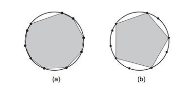

## 문제

다각형의 모든 꼭짓점이 한 원의 위에 있을 때, 그 다각형은 내접한다고 한다. 원에 내접하는 다각형이 주어진다. 이때, 이 다각형이 정다각형이 되기 위해서 지워야 하는 꼭짓점의 개수를 구하는 프로그램을 작성하시오. 정다각형이란, 모든 각의 크기가 같고, 변의 길이가 같은 다각형을 말한다.

다각형에서 꼭짓점 v를 제거하려면, 먼저, 그 꼭짓점과 연결된 꼭짓점 w1과 w2를 찾아야 한다. 그 다음, w1과 w2를 이어, 새로운 변을 만들면 된다.

아래 그림 (a)는 꼭짓점의 수가 10개인 원에 내접하는 다각형이고, (b)는 (a)에서 꼭짓점 다섯 개를 제거해, 정오각형을 만든 그림이다.

다각형의 변의 개수는 적어도 세 개이다.

## 입력

입력은 여러 개의 테스트 케이스로 이루어져 있다. 각 테스트 케이스의 첫째 줄에는 내접 다각형의 꼭짓점의 수 N이 주어진다. (3 ≤ N ≤ 104) 둘째 줄에는 N개의 정수 Xi가 주어진다. (1 ≤ Xi ≤ 103) Xi는 내접 다각형의 각 꼭짓점 사이의 호의 길이이다. 즉, i번 꼭짓점과 (i+1) mod N번 꼭짓점 사이의 호의 길이이고, 시계 방향으로 주어진다. 호는 현과 다르다.

입력의 마지막 줄에는 0이 하나 주어진다.

## 출력

각 테스트 케이스에 대해서, 정다각형으로 만들기 위해 제거해야 하는 꼭짓점의 최소 개수를 출력한다. 만약, 정다각형을 만들 수 없다면, -1을 출력한다.
