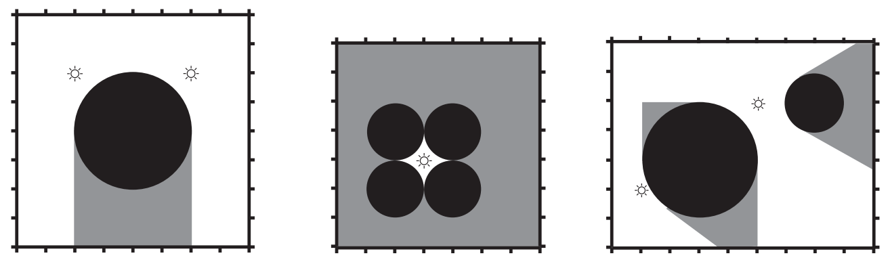

## 문제

The ICPC world finals will be held in a luxurious hotel with a big ballroom. A buffet meal will be served in this ballroom, and organizers decided to decorate its walls with pictures of past champion teams.

In order to avoid criticism about favouring some of those teams over others, the organizing commitee wants to make sure that all pictures are appropiately illuminated. The only direct way they’ve found for doing this is ensuring each picture has at least one lightbulb that directly illuminates it.

In this way, the perimeter of the ballroom wall can be divided into illuminated parts (in which pictures may be placed) and dark parts (which are not suitable for placing the pictures).

The ballroom has the shape of a box and contains several lightbulbs. Each lightbulb emits light in all directions, but this light can be blocked by columns. All columns in the ballroom have cylindrical shape and go from the floor to the ceiling, so light cannot pass over or above them. Columns are of course placed so that its circular section is parallel to the ballroom floor. Any given point p on the perimeter wall is said to be illuminated if there exists a line segment (a light ray) which starts on a lightbulb, ends in p and does not touch or pass through any column.

Top view of 3 ballrooms with their lightbulbs, columns and illuminated and dark areas

Your task as a helper of the ICPC organization is to examine the blueprints of the ballroom and determine the total length of illuminated sections of the perimeter wall. The blueprint consist of a rectangle indicating a top view of the ballroom, with the lightbulbs and columns marked in it.

## 입력

Each test case will consist on several lines. The first line will contain four integers: L, the number of lightbulbs, C, the number of columns, X, the size of the ballroom on the x coordinate and Y , the size of the ballroom on the y coordinate. The lower-left corner of the ballroom is at (0, 0) while the upper-right corner is at (X, Y ).

The next L lines will contain two integers each representing the x and y coordinate of each lightbulb. The last C lines of the test case will contain three integers each, representing the x and y coordinates of the center of a column and its radius, in that order. You can assume that 1 ≤ L, C ≤ 103 and 4 ≤ X, Y ≤ 106. Also, for all pairs of coordinates (x,y), 0 < x < X and 0 < y < Y , both for lightbulbs and column center locations. All radii of the columns will be positive. Finally, no two columns will overlap, although they may touch, and no column will touch or intersect with the border of the ballroom. No lightbulb will be inside a column or in its boundary and no two lightbulbs will be in the same place.

Input is terminated with L = C = X = Y = 0.

The input must be read from standard input.

## 출력

For each test case, output a single line with the total length of the illuminated parts of the perimeter wall. The result must be printed as a real number with exactly four decimal figures, with the lowest-order decimal figure rounded up.

The output must be written to standard output.
