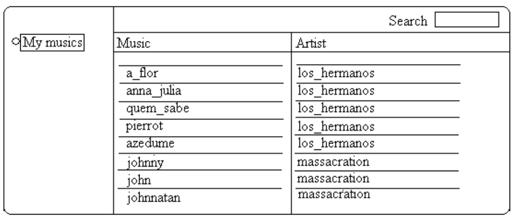
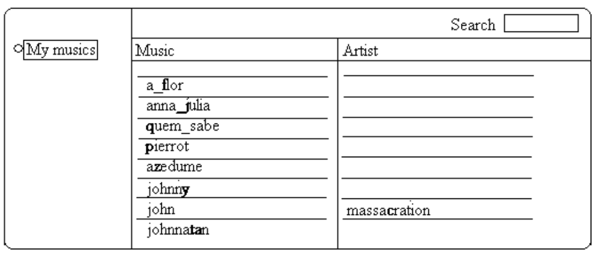

## 문제

The ICPC judges are preparing a party for the opening ceremony. For the party, they intend to add a playlist with some songs to the jukebox software (a simple MP3 player). However, there are so many songs in the computer that it is difficult to find the ones they want to add. As a consequence, they need to use the search feature many times.

In this jukebox, when you search for a string s, the software returns every music whose title or artist name contains s as a substring. String s is a substring of string t if t contains all characters of s as a contiguous sequence (for example, ‘bc’ is a substring of ‘abcd’, but ‘ac’ is not). To save their precious time, while looking for a song, they always use one of the song’s golden string, i.e. one of the shortest strings for which the search returns as a result only the song they want.

In the example above, a possible golden string for the song ‘johnnatan’ is ‘ta’. Note that ‘ta’ is not a substring of the name of another song nor a substring of the artist of another song. Note also that there is no string of size equal to 1 that could identify uniquely the song ‘johnnatan’.

They discovered that if they remove the artist fields from some of the songs they can get even smaller golden strings. For the song ‘john’, there is no golden string. However, if one removes the artist field from all other songs, the string ‘c’ becomes the golden string for the song ‘john’.

Given the song list (each song with name and artist), your job is to determine the minimum sum of the golden string sizes for all songs that can be obtained if one is allowed to remove some of the artist fields. In the figure above you can see a possible best result with the golden strings in bold. The minimum sum of the golden string sizes in this case is 10.

## 입력

The input contains several test cases. The first line of each test case contains one integer N (1 ≤ N ≤ 30), which indicates the number of songs. Following there will be N pairs of lines (2 ∗ N lines), one pair for each song. The first line of a pair will contain the song name, the second line will contain the artist name. Both artist and song names are strings containing only lower case letters or underlines and having at least 1 and at most 30 characters. There will be at most 6 different artists in the list.

The end of the input is given by N = 0.

## 출력

For each test case your program must output one single line with the minimum sum of the golden string sizes. You may assume that there will always be a solution.
