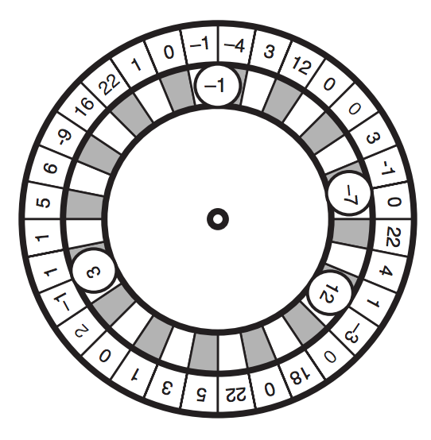

## 문제

Turkish Roulette is a betting game that uses a roulette with S slots, each one numbered with an integer between -64 and 64. In each turn of the game players bet on B balls, each one also numbered from -64 to 64. For each of the B balls, exactly one player will bet on it.

After spinning the roulette, the dealer throws in the B balls sequentially. When the roulette stops, each ball is lodged over two (adjacent) slots, as depicted in the figure below, which shows a roulette with thirty two slots and four balls. Notice that, as the figure illustrates, a ball occupies the space of two adjacent slots, and therefore there is room for at most bS/2c balls in the roulette.

Balls end up lodged in the same relative positions that they were thrown in the roulette. That is, if balls a, b and c are thrown in that sequence, they end up lodged such that, in clockwise direction, a is followed by b which is followed by c which is followed by a.

The value of a ball in a turn is calculated by multiplying the ball’s number by the sum of the numbers of the two adjacent slots over which the ball is lodged. If a ball’s value is positive, the player who bet on that ball receives that amount (the ball’s value) from the dealer; if a ball’s value is negative, the player who bet on that ball must pay that amount to the dealer. The profit of the dealer in a turn is the total amount received minus the total amount paid.

For example, in the figure above, the dealer pays \$5.00 for ball numbered −1, pays \$7.00 for ball numbered −7, receives \$24.00 for ball numbered 12 and does not pay nor receive anything for ball numbered 3. Therefore, in this turn the dealer makes a profit of \$12.00 (24 − 5 − 7); note that the dealer’s profit in a turn may be negative (loss).

You will be given the description of the roulette, the description of the balls and the sequence in which the balls are thrown into the roulette. Write a program to determine the maximum profit that the dealer can make in one turn.

## 입력

Input contains several test cases. The first line of a test case contains two integers S and B which indicate respectively the number of slots in the roulette (3 ≤ S ≤ 250) and the number of balls used (1 ≤ B ≤ \(\lfloor\)S/2\(\rfloor\)). The second line of a test case contains S integers Xi, indicating the numbers associated to the roulette’s slots, in clockwise direction (−64 ≤ Xi ≤ 64, for 1 ≤ i ≤ S). The third line of a test case contains B integers Yi, indicating the numbers associated to the balls (−64 ≤ Yi ≤ 64, for 1 ≤ i ≤ B), in the sequence the balls are thrown into the roulette (notice it is in this order that they end lodged in the roulette, in clockwise direction). The end of input is indicated by S = B = 0.

## 출력

For each test case in the input your program must write one line of output, containing an integer indicating the maximum profit the dealer can make in one turn.
