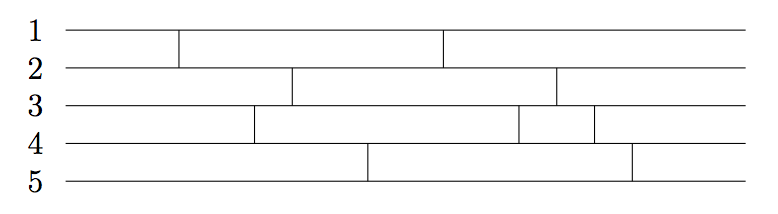

## 문제

Pretty Networks Inc. is a company that builds some curious artifacts whose purpose is to transform a set of input values in a given way. The transformation is determined by what they call a p-network. The following picture shows an example of a p-network.

In the general case, a p-network of order N and size M, has N horizontal wires numbered 1, 2, . . . N, and M vertical strokes. Each stroke connects two consecutive wires. There are no two different strokes touching the same point of any wire, and there is no stroke touching the leftmost or rightmost point of any wire. The above example is a p-network of order 5 and size 9.

The transformation determined by a p-network can be explained using a set of rules that govern the way a p-network should be traversed:

1. start at the leftmost point of one wire, and go to the right;
2. each time a stroke appears move to the connected wire, and keep going from left to right;
3. stop when the rightmost point of one wire is reached.

If starting at wire i the traversing ends at wire j, we say that the p-network transforms i into j, and we denote this with i → j. In the above example the p-network determines the set of transformations

{1 → 3, 2 → 5, 3 → 4, 4 → 1, 5 → 2} .

Pretty Networks Inc. hired you to solve the following p-network design problem: given a number N and a set of transformations {1 → i1, 2 → i2, . . . N → iN}, decide if a p-network of order N can be built to accomplish them and, in this case, give one that does it.

When there exists a solution with a certain size, in many cases there is another solution with a greater size. Scientists at Pretty Networks Inc. have stated that if there exists a solution for a p-network design problem, then there is a solution with size less than 4N2. Therefore, they are interested only in solutions having a size below this bound.

## 입력

The input has a certain number of p-network design problems. Each problem is described in just one line that contains the values N, i1, i2, . . . iN, separated by a single blank space. The value N is the order of the desired p-network, i.e., its number of wires (1 ≤ N ≤ 20). The values i1, i2, . . . iN represent that the p-network should determine the set of transformations {1 → i1, 2 → i2, . . . N → iN} (1 ≤ ij ≤ N, for each 1 ≤ j ≤ N). The input ends with a line in which N = 0; this line must not be processed as a p-network design problem.

## 출력

For each p-network design problem in the input, the output must contain a single line. If the problem has no solution the line must be No solution. Otherwise the line must contain a description of any p-network (with N wires and less than 4N2 strokes) that accomplishes the requested set of transformation. This description is given by a set of values M, s1, s2, . . . sM, where consecutive values are separated by a single blank space. The value M is the size of the p-network, i.e., its number of strokes. The values s1, s2, . . . sM describe the strokes of the p-network; it should be understood that the i-th stroke from left to right, connects the wires si and 1 + si (1 ≤ i ≤ M). Notice that 0 ≤ M < 4N2 , while 1 ≤ si < N for each 1 ≤ i ≤ M.
