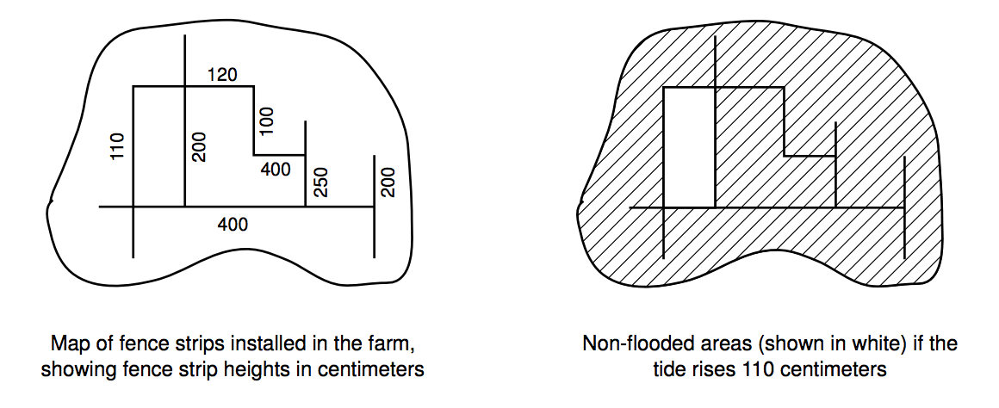

## 문제

Zing Zhu owns an island that is a piece of flat land. Everyday, when the tide rises, the island is flooded by sea water. After much thinking and asking advice from members of his family, Zing Zhu decided to set up an oyster farm in the island. Zing Zhu uses a sophisticated system of plastic watertight modular fences to control the areas that will be flooded and the areas that will not be flooded during the rise of the tide. The fences used by Zing Zhu are either horizontal or vertical and come in strips that have different lengths and heights. Two fences can intersect in at most one point, not necessarily in their ends.

You have been contacted by Zing Zhu to calculate, given the height the tide will reach and the position and height of all fence strips, the total area of land which will not be flooded during the high tide. You may assume that the widths of fence strips are so thin compared to the size

of the land that, for the purpose of calculating the total area, fence strips may be considered as having widths equal to zero.

## 입력

The input contains several test cases. The first line of a test case contains an integer N indicating the number of fence strips in the island (1 ≤ N ≤ 2000). Each of the next N lines contains five integers X1, Y1, X2, Y2 and H, representing respectively the start point of the strip (X1, Y1), the end point of the strip (X2, Y2) and the strip height (H). The last line of a test case contains an integer W representing the tide height. Coordinates are given in meters, heights in centimeters. Furthermore, X1 = X2 or Y1 = Y2 (but not both); −500 ≤ X1, Y1, X2, Y2 ≤ 500; and 1 ≤ W, H ≤ 1000. The end of input is indicated by N = 0.

## 출력

For each test case in the input your program must produce one line of output, containing one integer representing the total area (in m2) of the land which will not be flooded.
