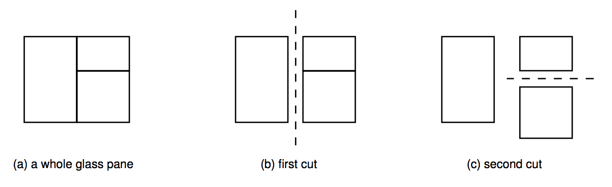

## 문제

Uncle Jeff owns a glass shop, which sells glass panes for windows and picture frames. As you probably know, a glass pane can only be cut if the cut goes from edge to edge of the pane in a straight line. The figure below shows how a glass pane can be cut into three smaller glass panes.

Uncle Jeff normally operates as follows. He first collects various orders for small rectangular glass panes, for windows or picture frames. He then marks the position of each small rectangular pane onto a big rectangular glass pane, such that no two marked rectangles overlap. Finally, he performs a sequence of horizontal and vertical cuts, always from edge to edge of the pane being cut, so as to produce glass panes for all the customers.

Since the last phase (the actual cutting of the big glass pane into pieces) is the most boring thing one could ever imagine, uncle Jeff is asking you for help. He wants a program which given a big rectangular glass pane and lower-left and upper-right coordinates of each marked rectangle determines the order in which the edge-to-edge cuts can be performed. This list of cuts will be fed into a machine which will do the boring cuts for him!

## 입력

The input contains several test cases. The first line of a test case contains an integer N indicating the number of windows and picture frames in the test (2 ≤ N ≤ 2000). Each of the next N lines contains four integers X1, Y1, X2, Y2, where (X1, Y1) and (X2, X2) represent the lower-left and upper-right coordinates marked by uncle Jeff on the big glass pane (−5000 ≤ X1, Y1, X2, Y2 ≤ 5000; X1 < X2 and Y1 < Y2). You should assume the following of each test case:

* The marked rectangles do not overlap (but may intersect on the border points) and divide the big glass pane completely into rectangular regions, so that no glass is wasted. This means that the lower-left and upper-right coordinates of the big glass pane can be inferred from the coordinates of the marked rectangles.
* It is possible to split up the big glass pane into the small marked rectangles through a sequence of edge-to-edge cuts.

The end of input is indicated by N = 0.

## 출력

For each test case in the input your program must produce an ordered list of cuts that must be performed to separate the big glass pane into the desired smaller panes. Each cut must appear in a different line. A cut is described by four integers X1, Y1, X2, Y2, where (X1, Y1) and (X2, Y2) specify the endpoints of the cut, with X1 < X2 and Y1 = Y2 for a horizontal cut and X1 = X2 and Y1 < Y2 for a vertical cut. As more than one ordering of cuts may be possible, your program must print the list in a particular order. If at some point more than one cut is possible, print first the cut with smaller X1; if more than one cut is still possible, print first the one with smaller Y1. Print a blank line after each test case list.
