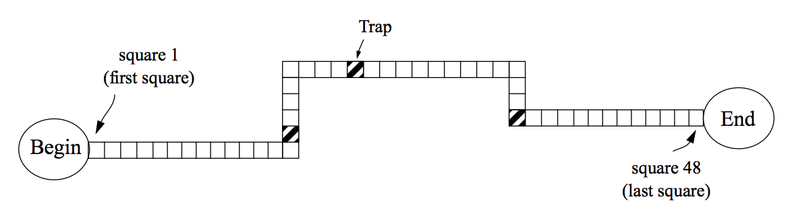

## 문제

A simple boardgame that generations of children have played consists of a board containing a trail of squares and a set of colored pieces. At the beginning of the game each player is assigned a piece; all pieces are initially positioned right before the first square of the trail.

The game proceeds in rounds. At each round, players rolls a pair of dice, and move their pieces forward a number of squares equal to the rolled result. Players roll the dice always in the same order (player A, then player B, etc.) in the rounds.

Most of the squares on the board are plain squares, but some are “traps”. If a player’s piece falls on a trap square at the end of the player’s move, the player misses the next round. That is, she/he does not roll the dice, and her/his piece stays one round without moving.

There will be exactly three traps on the trail.

The winner of the game is the player whose piece reaches the end of the trail first. The end of the trail is after the last square of the board. Consider, for example, the board in the figure above, which has squares numbered from 1 to 48. At the start, the pieces are positioned at the place marked ‘Begin’ in the figure, that is, before the square number 1. Therefore, if a player rolls a 7 (dice showing 2 and 5 for example), her/his piece is positioned at square number 7 at the end of the first round of the game. Furthermore, if a player’s piece is positioned at square 41, the player needs a roll result of at least 8 to reach the end of the trail and win the game. Notice also that there will be no draw in the game.

You will be given the number of players, the number of squares in the trail, the location of the traps and a list of dice rolls results. You must write a program that determines the winner.

## 입력

Your program should process several test cases. The first line of a test case contains two integers P and S representing respectively the number of players and the number of squares in the trail (1 ≤ P ≤ 10 and 3 ≤ S ≤ 10000). The second line describes the traps, represented by three distinct integers T1 , T2 and T3 , denoting their positions in the trail (1 ≤ T1 , T2 , T3 ≤ S). The third line contains a single integer N indicating the number of dice rolls in the test. Each of the following N lines contain two integers D1 and D2 (1 ≤ D1 , D2 ≤ 6), representing the results of the dice rolls. The end of input is indicated by P = S = 0. The set of dice roll results in a test will be always the exact number necessary for a player to win the game.

A player is identified by a number from 1 to P. Players play in a round in sequential order from 1 to P.

## 출력

For each test case in the input, your program should output a single integer: the number representing the winner.
