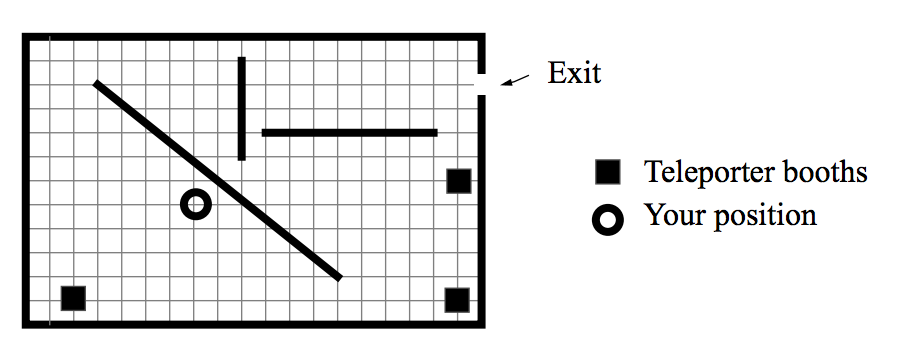

## 문제

In the year of 2222, a terrible disaster happened at the kryptonite mine in Mars: a marsquake shook that part of the planet. Differently from earthquakes in Earth, marsquakes are not unusual on Mars. This one, however, caused the mine to start sinking slowly into the soil. The mine has a rectangular external shape, and its interior is like a maze, with high, straight walls and, most importantly, teleporters. Teleporters, as you know, can transport people instantly from one place to another. Teleporters in the mine are old models, using ancient technology, and can only teleport people if there is a clear view from one teleporter booth to another (that is, if there are no obstacles or walls in between the booths). You can see the map of the mine in the figure below.

You are trapped alone inside the mine. Fortunately, you have a map of the whole mine, know your current location, the positions of the walls, the locations of the exit and all teleporter booths. Unfortunately, the marsquake affected the energy system, and you know the teleporters can be used for a limited number of times only.

You want to get out of the mine walking as little as possible, since you sprained your ankle during the marsquake. You must find the route from your present location to the exit that requires the least amount of walking.

## 입력

The input consists of many test cases. The first line of a test case contains three integers N, M and L, which indicate, respectively, the number of times the teleporters can be used, the number of walls in the mine and the number of teleporter booths (0 ≤ N, M, L ≤ 50). Each of the next M lines contains four integers X1 , Y1 , X2 and Y2 , which represent the coordinates of the endpoints of a wall. You may ignore the thickness of walls and assume they do not intersect each other (–20000 ≤ X1 < X2 ≤ 20000 and –20000 ≤ Y1 < Y2 ≤ 20000). The next L lines contain the location of teleporter booths, given by two integers Xp and Yp . The last line of each test case contains four integers Xb , Yb , Xe and Ye where (Xb , Yb ) are the coordinates of your location and (Xe , Ye ) are the coordinates of the mine's e xit. The end of input is indicated by M=N=L=0.

## 출력

For each test case in the input your program must output a single line, containing an integer representing the distance you need to walk to get out of the mine. Of course, you should not consider the distances you teleported.The distance must be rounded to the nearest integer.
