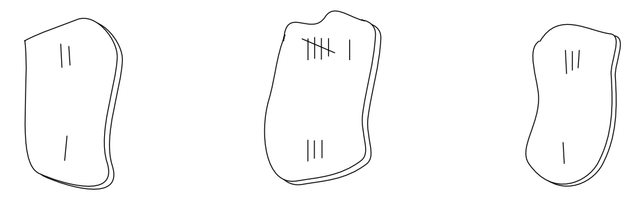

## 문제

Natives from the tiny island of Tookutoo are keen on mathematics, and teach their children to play several math-oriented games. A popular puzzle in Tookutoo is played with ceramic slabs like the ones shown in the figure below.



As it can be seen in the figure above, slabs are similar to dominoes, being divided in two parts; in each part an integer value is imprinted. The slabs above have values [2, 1], [6, 3] and [3, 1]. Note that a slab[a, b] can also be written as [b, a].

The puzzle starts with a player receiving a set of slabs chosen randomly from a large and varied pool. Using the given set of slabs, the player has to find an arrangement in which the slabs are put side by side on the table in such a way that the sum of values on the upper side is equal to the sum of values on the lower side. For example, for the set in the figure above, a correct arrangement is

```

1 6 1
2 3 3
```

If it is not possible to find an arrangement using all the slabs chosen, the player may discard one of them, but the value of the sum in the arrangement must be the highest possible. Besides, if more than one slab can be discarded while leaving the same sum, the player must discard the slab [a, b] such that a ≤ b and a is the least possible value considering all possible slabs to be discarded.

You must write a program that, given a set of slabs, tries to find an arrangement that satisfies the conditions of the puzzle, discarding one slab if necessary.

## 입력

Your program should process several test cases. The first line of a test case contains a single integer N, the number of slabs in the test (0 ≤ N ≤ 400). Each of the following N lines contains two integers Xi and Yi describing a slab that was given to the player (0 ≤ Xi ≤ 1000 and 0 ≤ Yi ≤ 1000). The value N = 0 indicates the end of input.

## 출력

For each test case your program must produce one line describing the result. If it is not possible to find an arrangement, print the word ‘impossible’. If it is possible to find an arrangement, print its sum and the description of the discarded slab (if any). If you had do discard a slab, describe it in the form ‘discard X Y’, where X ≤ Y; otherwise print ‘discard none’.
