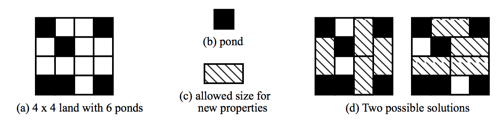

## 문제

Your old uncle Tom inherited a piece of land from his great-great-uncle. Originally, the property had been in the shape of a rectangle. A long time ago, however, his great-great-uncle decided to divide the land into a grid of small squares. He turned some of the squares into ponds, for he loved to hunt ducks and wanted to attract them to his property. (You cannot be sure, for you have not been to the place, but he may have made so many ponds that the land may now consist of several disconnected islands.) Your uncle Tom wants to sell the inherited land, but local rules now regulate property sales.

Your uncle has been informed that, at his great-great-uncle’s request, a law has been passed which establishes that property can only be sold in rectangular lots the size of two squares of your uncle’s property. Furthermore, ponds are not salable property.

Your uncle asked your help to determine the largest number of properties he could sell (the remaining squares will become recreational parks).

## 입력

Input will include several test cases. The first line of a test case contains two integers N and M, representing, respectively, the number of rows and columns of the land (1 ≤ N, M ≤ 100). The second line will contain an integer K indicating the number of squares that have been turned into ponds ( (N x M) – K ≤ 50). Each of the next K lines contains two integers X and Y describing the position of a square which was turned into a pond (1 ≤ X ≤ N and 1 ≤ Y ≤ M). The end of input is indicated by N = M = 0.

## 출력

For each test case in the input your program should produce one line of output, containing an integer value representing the maximum number of properties which can be sold.
